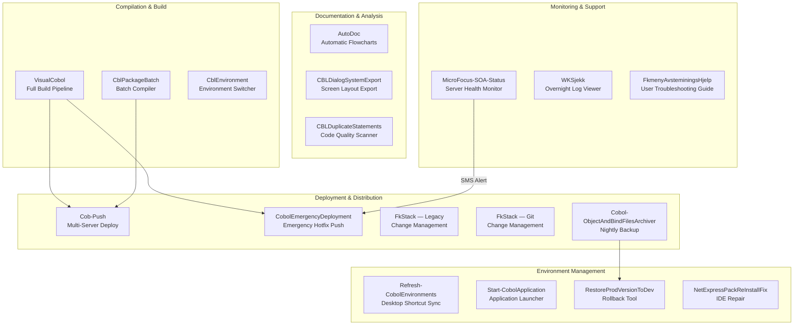

# Legacy Code Tools — Keeping 40-Year-Old Factory Machines Running in a Modern World

## What These Tools Do

Imagine a large factory that has been operating since the 1980s. The machinery still works perfectly — it processes thousands of transactions every day — but the instruction manuals are written in a language few people speak anymore, and the spare parts are getting harder to find.

That factory is **COBOL** — a programming language from 1959 that still processes an estimated 95% of ATM transactions and 80% of in-person financial transactions worldwide. The Legacy Code Tools are the team of expert mechanics, translators, and safety inspectors that keep this factory humming while gradually modernizing it.

These 17 tools handle everything from compiling COBOL programs, deploying them to hundreds of workstations, generating documentation from code nobody fully understands anymore, and managing the complex environments where old meets new.

## Overview Diagram

## Tool-by-Tool Guide

### AutoDoc — Turns ancient code into visual flowcharts anyone can understand

Think of a museum that takes old handwritten factory blueprints and turns them into interactive, zoomable diagrams you can browse on your tablet. AutoDoc reads source code in six different languages (COBOL, REXX, PowerShell, Batch, SQL, and C#) and automatically generates HTML flowchart documentation with Mermaid diagrams.

It runs nightly as a scheduled task, handles multi-threaded processing for speed, supports RAM disks for performance, and publishes results to an internal website. It can process thousands of source files incrementally (only changed files) or do a full regeneration.

**Who needs it:** Any organization maintaining legacy codebases that needs to understand what the code actually does without reading it line by line. Also valuable during onboarding, audits, and compliance reviews.

**Can it be sold standalone?** Yes — high standalone value. Automated documentation generation for legacy codebases is a recognized market need with few competitors offering multi-language support. Could be offered as SaaS.

---

### CBLDialogSystemExport — Captures the "face" of legacy programs

When old COBOL programs interact with users, they show text-based screens called Dialog Systems. This tool exports those screen definitions so they can be documented, analyzed, or rebuilt in modern interfaces. Think of it as photographing every page of an old instruction panel before replacing it.

**Who needs it:** Teams migrating legacy terminal interfaces to modern web UIs. Preserves institutional knowledge about how the user-facing side of old programs worked.

**Can it be sold standalone?** Niche — valuable as part of a migration toolkit, but limited standalone market.

---

### CBLDuplicateStatements — Quality inspector for COBOL code

Scans COBOL source code for duplicate and redundant statements. In a 40-year-old codebase, copy-paste duplication is endemic. This tool identifies it, helping developers consolidate and clean up code before migration or during maintenance. Like a factory inspector identifying redundant wiring that could cause problems.

**Who needs it:** COBOL maintenance teams and migration projects aiming to reduce technical debt.

**Can it be sold standalone?** Moderate — could be part of a COBOL code quality suite. The COBOL quality tool market is small but underserved.

---

### CblEnvironment — Switches between legacy runtime versions

A single machine may need to run different versions of the COBOL runtime (MicroFocus NetExpress vs. Visual COBOL, 32-bit vs. 64-bit). This tool rewires the system PATH and environment variables to switch between them — like changing which set of tools a factory floor uses depending on which product line is running.

**Who needs it:** Developers working on COBOL systems who need to compile or test against different runtime versions.

**Can it be sold standalone?** No — too environment-specific.

---

### CblPackageBatch — The COBOL compiler assembly line

Compiles COBOL programs in batch, handling the complex chain of copy elements, SQL preprocessing, and environment configuration. This is the core build engine — like the main assembly line that turns raw code into executable programs. It processes DB2 SQL tables, manages copy files, and handles the packaging of compiled objects.

**Who needs it:** Any team building and deploying COBOL applications with DB2 database integration.

**Can it be sold standalone?** No — tightly coupled to the specific COBOL/DB2 environment.

---

### Cob-Push — Distributes compiled COBOL to hundreds of workstations

After programs are compiled, they need to reach the machines that run them. Cob-Push uses multi-threaded robocopy operations to push compiled COBOL objects (.int, .gs files) and bind files (.bnd) to up to 100 AVD workstations simultaneously. Like a delivery fleet distributing updated parts to all franchise locations overnight.

**Who needs it:** Operations teams managing Citrix/AVD farms running COBOL applications.

**Can it be sold standalone?** No — infrastructure-specific deployment tool.

---

### Cobol-ObjectAndBindFilesArchiver — Nightly backup of all compiled COBOL

Every night, this tool archives compiled COBOL files from all environments (production, test, development, migration, etc.) into timestamped zip files. It uses robocopy for efficient incremental syncing and automatically cleans up archives older than a configurable retention period. Think of it as the factory's daily shift log — a complete record of what was running on any given day.

**Who needs it:** Operations teams needing disaster recovery, audit trails, or the ability to compare what changed between deployments.

**Can it be sold standalone?** No — environment-specific, though the pattern is reusable.

---

### CobolEmergencyDeploymentToAVD — Emergency hotfix delivery to production

When something breaks in production and needs an immediate fix, this tool bypasses the normal overnight deployment cycle and pushes updated COBOL files directly to all online AVD workstations (up to 150 machines) using 32 parallel threads. Safety-first design: read-only on source, never deletes, only copies newer files. Includes a test mode for safe verification.

**Who needs it:** On-call operations staff responding to production incidents.

**Can it be sold standalone?** No — emergency operations tooling for a specific infrastructure.

---

### FkStack (LegacyCodeTools) — Change management with ServiceNow integration

The original deployment and change tracking system. When a developer modifies COBOL programs, FkStack stages the changes, creates a ServiceNow change request (for ITIL compliance), and queues them for overnight deployment. It handles multi-environment deployment (production, test, migration) and creates audit trails. Like the factory's work order system.

**Who needs it:** Change management teams requiring ITIL-compliant deployment workflows.

**Can it be sold standalone?** Moderate — the ServiceNow integration pattern has value, but the COBOL specifics limit the market.

---

### MicroFocus-SOA-Status — Health monitor for the COBOL runtime server

Checks the MicroFocus SOA server's thread count and sends SMS alerts if threads are running dangerously high (above 500). Writes monitoring files for external dashboards. Like a factory floor temperature gauge that pages the on-duty engineer when readings exceed safe levels.

**Who needs it:** Operations teams monitoring MicroFocus COBOL Server deployments.

**Can it be sold standalone?** No — specific to MicroFocus server infrastructure.

---

### NetExpressPackReInstallFix — Repairs broken COBOL IDE installations

When the MicroFocus NetExpress IDE breaks (corrupt registry entries, failed updates), this tool automates the complete uninstall-reinstall cycle, including registry cleanup, file removal, and reboot. Like calling in a specialized technician to strip down and rebuild a malfunctioning machine tool.

**Who needs it:** IT support teams maintaining developer workstations with legacy COBOL IDEs.

**Can it be sold standalone?** No — specific to MicroFocus NetExpress.

---

### Refresh-CobolEnvironments — Keeps desktop shortcuts in sync with server environments

As COBOL environments change on servers, the desktop shortcuts that developers use to access them can become stale. This tool reads the current state from the Cobol-Handler module and regenerates all shortcuts automatically. Like updating the factory floor directory when departments move.

**Who needs it:** IT teams managing developer environments with multiple COBOL runtime targets.

**Can it be sold standalone?** No — environment management utility.

---

### RestoreProdVersionToDev — Production rollback for individual programs

When a developer needs to revert a specific COBOL program to the last known good production version, this tool finds the latest archived zip in the COBOL archive, shows what it contains, and asks for confirmation before restoring source code and compiled binaries. A precision rollback tool — like being able to swap out one gear in the machine instead of replacing the whole assembly.

**Who needs it:** Developers and release managers dealing with regression issues.

**Can it be sold standalone?** No — tightly coupled to the archive structure.

---

### Start-CobolApplication — Launches COBOL programs with proper configuration

A controlled launcher that starts COBOL applications with the correct environment, database catalog, and runtime version. Ensures programs run with the right dependencies, like a startup checklist that a factory operator follows before engaging a piece of equipment.

**Who needs it:** Operators and QA teams needing to run COBOL programs in specific configurations.

**Can it be sold standalone?** No — wrapper for internal infrastructure.

---

### VisualCobol — The full modernization pipeline (8-step build system)

The crown jewel of legacy tools. An 8-step automated pipeline that takes COBOL source code through copying, validation, environment setup, batch compilation, DB2 binding, migration reporting, server deployment, and source distribution. This is the bridge between the old mainframe world and modern Windows servers — like a complete factory renovation project managed by a single control system.

Steps: Copy Sources → Check Copybooks → Initialize Environment → Batch Compile → DB2 Bind → Migration Report → Deploy to Server → Distribute Sources

**Who needs it:** Organizations migrating from mainframe COBOL to Visual COBOL on Windows Server.

**Can it be sold standalone?** Yes — high value. COBOL migration pipelines are a significant consulting market. This is a productizable automation framework.

---

### WKSjekk — Morning health check for overnight batch jobs

Opens the overnight COBOL batch job logs in separate terminal windows so operators can quickly verify that everything ran successfully. Like the morning shift supervisor checking the overnight production logs.

**Who needs it:** Operations teams responsible for overnight batch processing.

**Can it be sold standalone?** No — simple log viewer.

---

### FkmenyAvsteminingsHjelp — User-facing troubleshooting guide

An HTML help page deployed to stores explaining how to fix Verifone payment terminal reconciliation errors. Includes step-by-step instructions with screenshots. Like a laminated instruction card posted next to a piece of equipment.

**Who needs it:** End users (store employees) experiencing payment terminal issues.

**Can it be sold standalone?** No — customer-specific support documentation.

---

## Revenue Potential

| Revenue Tier | Tools | Est. Annual Value |
|---|---|---|
| **High — Productizable** | AutoDoc, VisualCobol Pipeline | $200K–$500K as managed services or licensed tools |
| **Medium — Consulting Value** | FkStack (ServiceNow integration pattern), CBLDuplicateStatements | $50K–$150K as part of migration consulting |
| **Bundled Value** | All 17 tools together as a "Legacy Modernization Toolkit" | $300K–$800K per enterprise engagement |
| **Recurring** | AutoDoc SaaS for legacy documentation | $5K–$20K/month per customer |

The COBOL modernization market is valued at over $3 billion annually and growing as the workforce that understands these systems retires. Organizations are desperate for tools that bridge old and new.

## What Makes This Special

1. **Battle-tested on real production systems** — These tools manage a live retail/financial system processing thousands of daily transactions, not academic exercises.

2. **Complete lifecycle coverage** — From documentation (AutoDoc) through compilation (VisualCobol, CblPackageBatch) to deployment (Cob-Push, EmergencyDeployment) and monitoring (MicroFocus-SOA-Status), the entire COBOL lifecycle is automated.

3. **Safety-first design** — Emergency deployment tools are read-only on source, never delete, and include test modes. Rollback tools require explicit confirmation. Change management creates audit trails.

4. **Multi-threaded performance** — Deployment to 150 workstations uses 32 parallel threads. AutoDoc processes thousands of files using configurable thread pools. RAM disk support for compilation speed.

5. **Filling a dying expertise gap** — As COBOL experts retire, these tools encode their knowledge into automation. AutoDoc alone preserves understanding that would otherwise be lost forever.
