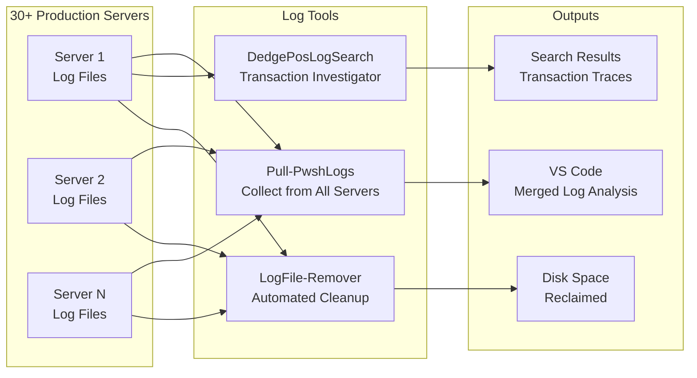

# Log Tools — Finding Needles in Haystacks of Server Output

## What These Tools Do

Every computer system writes a diary. Every transaction processed, every error encountered, every scheduled job that ran — it all gets written to log files. On a busy system, these diaries can generate gigabytes of text per day across dozens of servers.

Now imagine you need to find out what happened to a specific transaction at 2:47 PM on a Tuesday, across 30 servers, in files containing millions of lines. Or imagine those log files are growing unchecked, silently filling up hard drives until a server crashes at 3 AM.

The Log Tools are the investigator, the janitor, and the filing clerk. They search logs with surgical precision, clean up old files before they cause problems, and collect logs from across the entire server fleet to one place where you can analyze them.

## Overview Diagram

## Tool-by-Tool Guide

### DedgePosLogSearch — Transaction detective for point-of-sale systems

When a store reports that a payment terminal failed, a receipt was wrong, or a transaction disappeared, this tool digs through point-of-sale log files to find out exactly what happened. It offers multiple search modes:

- **Transaction search** — Find a specific transaction by ID (format: 00XXXX-XXXXXX) and trace every log entry related to it across all log files
- **Terminal search** — Find all activity for a specific payment terminal (BT_XXXX identifiers)
- **IO Exception search** — Find terminals experiencing connection drops (IOException + ConnectionClosed patterns), generating a report of affected terminals
- **Free-text search** — Search for any string across all POS log files
- **Reversal search** — Find transaction reversals (refunds, cancelled payments)
- **Unhandled transaction search** — Find transactions that the system could not process

The tool handles compressed (.zip) log archives, processes multiple log files simultaneously, and cross-references transaction IDs to build complete transaction timelines.

Think of it as a detective who can read every cash register's receipt tape across every store location and tell you exactly what happened with any specific payment.

**Who needs it:** Support teams investigating payment and POS issues. Compliance teams auditing transactions. Operations teams monitoring terminal health.

**Can it be sold standalone?** Yes — high standalone value. POS log investigation tools are needed by every retail chain. The multi-terminal, multi-file search with transaction tracing is a differentiator.

---

### LogFile-Remover — Automated disk space janitor for all servers

Log files grow silently until they fill up a hard drive and crash the server. This tool runs as a scheduled task and systematically removes old log files (older than 30 days) across all drives on every server.

Intelligence built in:
- **Smart drive scanning** — Finds all valid drives, skips system drive (C:) except for specific directories (opt, tempfk)
- **DB2 awareness** — On database servers, automatically detects DB2 instance names and excludes their log directories (critical: deleting DB2 transaction logs would destroy the database)
- **Exclusion patterns** — Never touches system directories (ProgramData, Windows, Users), shared modules (DedgeCommon), or application logging frameworks (CommonLogging)
- **WhatIf mode** — Can simulate the cleanup to show what would be deleted without actually removing anything
- **Multi-format** — Cleans .log, .out, and .err files

Think of it as a building janitor who knows which trash cans to empty and which filing cabinets to never touch.

**Who needs it:** Every organization running Windows servers. Disk space management is a universal operational need.

**Can it be sold standalone?** Yes — moderate standalone value. The DB2-aware exclusion logic and smart drive scanning differentiate it from simple "delete old files" scripts. Could be part of a "Server Hygiene Suite."

---

### Pull-PwshLogs — Collects logs from every server to your desk

When you need to investigate an issue that could involve any server in the fleet, you do not want to log into 30 servers one by one. Pull-PwshLogs reaches out to every managed server, grabs that day's PowerShell log file (FkLog_YYYYMMDD.log), copies it to a local folder, and opens the collection in VS Code for analysis.

Features:
- **Date selection** — Choose from today or up to 7 days back, with a 30-second timeout prompt
- **Fleet-wide collection** — Pulls from every server returned by `Get-ValidServerNameList`
- **Progress tracking** — Shows a progress bar as it processes each server
- **Instant analysis** — Opens the collected logs directly in VS Code for searching and comparison
- **Clean workspace** — Clears previous log copies before each run to avoid confusion

Think of it as calling every branch office and asking them to fax you their daily activity report — except it happens in seconds, not hours.

**Who needs it:** Operations and support teams troubleshooting issues that could originate from any server in the infrastructure.

**Can it be sold standalone?** Moderate — the pattern of "collect distributed logs to one place" is valuable. Enterprise log aggregation tools (Splunk, ELK) do this better at scale, but this is simpler and works without additional infrastructure.

---

## Revenue Potential

| Revenue Tier | Tools | Est. Annual Value |
|---|---|---|
| **High — Productizable** | DedgePosLogSearch | $80K–$200K as "POS Transaction Investigator" for retail chains |
| **Medium — Utility Value** | LogFile-Remover | $20K–$50K as part of "Server Maintenance Suite" |
| **Consulting Accelerator** | Pull-PwshLogs | Saves 2–4 hours per incident investigation |
| **Bundle** | All 3 tools as "Enterprise Log Management Toolkit" | $100K–$250K per enterprise deployment |

The POS log search tool has the highest standalone value because it solves a specific, recurring, high-urgency problem: "A customer is complaining about a payment — what happened?" The faster you can answer that question, the less money you lose.

## What Makes This Special

1. **Domain-specific intelligence** — DedgePosLogSearch does not just search text; it understands POS transaction structures, terminal identifiers, IO exception patterns, and reversal logic. This domain knowledge took years to accumulate and is encoded into the search modes.

2. **DB2-safe cleanup** — LogFile-Remover is not just a "delete old files" script. It understands that DB2 database servers have critical log directories that must never be touched, and it dynamically discovers and excludes them. This prevents the catastrophic "someone cleaned up logs and destroyed the database" scenario.

3. **Fleet-scale operations** — Both LogFile-Remover and Pull-PwshLogs operate across the entire server fleet, not just one machine. This fleet-level thinking is what separates operational tooling from simple scripts.

4. **Investigation workflow** — Pull-PwshLogs does not just collect files; it opens them in an editor ready for analysis. The entire workflow from "I need to check the logs" to "I am looking at the logs" takes under 60 seconds regardless of how many servers are involved.
