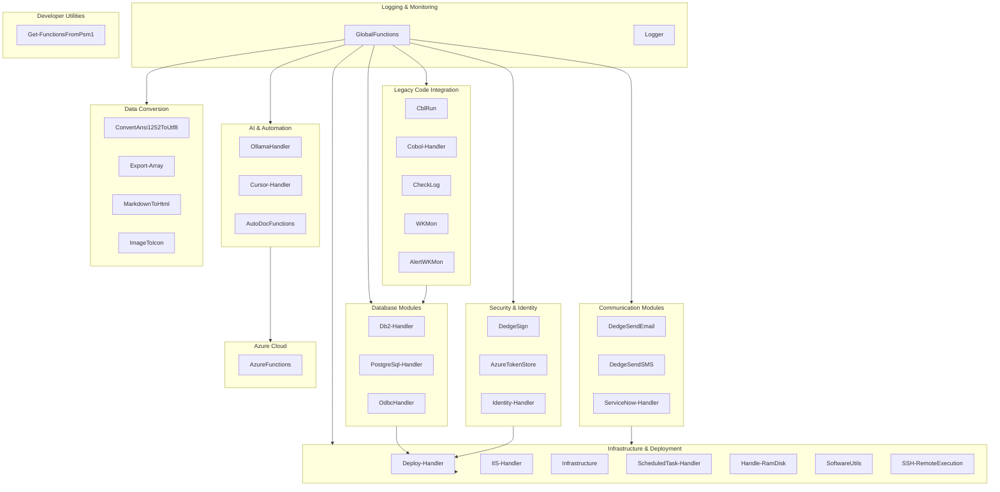

# DedgePsh Module Library — The Building Blocks of Every Dedge Application

> **37 reusable PowerShell modules** that power the entire Dedge ecosystem — from database management and AI integration to legacy COBOL program execution and cloud deployment.

---

## What Are Modules? (For Non-Programmers)

Think of modules as **LEGO bricks for software**. Each brick (module) does one specific job really well. When a developer builds an application, they don't write everything from scratch — they snap together the bricks they need.

For example:
- Need to send an email? Snap in the **email module**.
- Need to talk to a database? Snap in the **database module**.
- Need to deploy software to 20 servers? Snap in the **deployment module**.

This means:
- **Faster development** — don't reinvent the wheel every time
- **Fewer bugs** — each brick has been tested across dozens of real applications
- **Consistency** — every Dedge product works the same way under the hood
- **One fix benefits all** — improve a module once, every product that uses it gets better

The DedgePsh Module Library contains **37 production-grade modules** that have been refined over years of real-world enterprise use.

---

## Overview Diagram

---

## Module Catalog

---

### Database Modules

These modules let Dedge applications talk to databases — the systems that store all the important business data like customer records, transactions, and inventory.

---

#### Db2-Handler

**What it does:** This is like a **universal remote control for IBM DB2 databases**. DB2 is a powerful enterprise database used by banks, airlines, and large organizations. This module handles everything needed to connect to, query, and manage DB2 databases — including configuring security (Kerberos authentication), running SQL scripts, detecting errors, and managing database catalogs.

**Key capabilities:**
- **Connect to DB2 databases** — Sets up secure connections using both traditional passwords (NTLM) and modern enterprise security (Kerberos)
- **Run database commands** — Executes SQL queries and scripts, monitors for errors, and returns results
- **Manage configuration** — Creates catalog files, handles connection settings across environments (test, production)
- **Error detection** — Understands hundreds of DB2 error codes and can determine if a failure is critical or safely ignorable
- **Script execution** — Runs `.sql`, `.bat`, and `.ps1` database scripts with full monitoring
- **Database administration** — Buffer pool management, memory configuration, table operations, user account management, shadow database validation

**Who uses it:** Every Dedge product that needs to read or write data to IBM DB2 — including the core ERP system, batch processing, data migration tools, and reporting.

**Products that depend on this module:** AutoDoc, DbExplorer, CodingTools, Cursor DB2 MCP Server, all batch processing jobs, data migration tools.

**Product Potential:** Extremely high standalone value. IBM DB2 PowerShell tooling is a gap in the market. Could be packaged as "Dedge DB2 PowerShell Toolkit" — a comprehensive DB2 management solution for Windows administrators. Target market: any organization running DB2 on Windows (banking, insurance, government).

---

#### PostgreSql-Handler

**What it does:** The **equivalent of Db2-Handler, but for PostgreSQL databases**. PostgreSQL is the world's most popular open-source database. This module auto-detects PostgreSQL installations, tests connections, runs queries, creates databases, configures network access, manages backups and restores, and even repairs broken installations.

**Key capabilities:**
- **Auto-detect installation** — Finds PostgreSQL on the system, or installs it if missing
- **Connection management** — Tests connectivity, builds connection strings, verifies port configurations
- **Query execution** — Runs SQL queries and returns structured results
- **Database creation** — Creates new databases if they don't exist
- **Server configuration** — Sets up remote access (listen addresses, firewall rules, pg_hba.conf)
- **Backup and restore** — Full database backup (pg_dump) and restore (pg_restore) with multiple format support
- **Installation repair** — Rebuilds a broken PostgreSQL from scratch (initdb, service registration)
- **Health diagnostics** — Full diagnostic check: installation, service, config, ports, firewall, connectivity
- **Folder management** — Creates standard PostgreSQL directory structures with SMB shares
- **MCP server integration** — Tests and manages the PostgreSQL MCP server for AI-assisted database work

**Who uses it:** DedgeAuth (authentication system), GenericLogHandler (centralized logging), and any Dedge product using PostgreSQL.

**Products that depend on this module:** DedgeAuth, GenericLogHandler, PostgreSQL MCP Server.

**Product Potential:** Strong standalone value. A "PostgreSQL Windows Admin Toolkit" that auto-configures, diagnoses, backs up, and repairs PostgreSQL on Windows. Unique selling point: fully automated setup and repair, something no other tool does this well on Windows.

---

#### OdbcHandler

**What it does:** A **bridge to any database that supports ODBC connections**. ODBC (Open Database Connectivity) is a universal standard that lets software talk to many different types of databases through a single interface. This module reads ODBC connection settings from the Windows registry and executes SQL queries through those connections.

**Key capabilities:**
- **Get-OdbcConnection** — Retrieves ODBC connection details (name, type, path) from the Windows registry
- **ExecuteQuery** — Runs SELECT queries and returns results as structured objects
- **ExecuteNonQuery** — Runs INSERT, UPDATE, DELETE commands with transaction support (all-or-nothing safety)
- **GetOdbcConnectionCreateScript** — Generates a script to recreate an ODBC connection
- **Load-RequiredAssembly** — Automatically loads the correct database driver (32-bit or 64-bit)

**Who uses it:** Used as a fallback database connector when specialized modules (Db2-Handler, PostgreSql-Handler) are not needed. Supports any ODBC-compatible database.

**Products that depend on this module:** Db2-Handler (as a dependency), any product needing generic database access.

**Product Potential:** Moderate. ODBC connectivity modules exist, but this module's transaction safety and auto-assembly loading are valuable. Best bundled with the larger database toolkit.

---

### Communication Modules

These modules let Dedge applications send messages to people — via email, text message, or IT service management systems.

---

#### FKASendEmail (DedgeSendEmail)

**What it does:** Sends **emails** from any Dedge application. Supports plain text, HTML-formatted bodies, and file attachments. This is a wrapper around the core email functionality in GlobalFunctions for backward compatibility.

**Key capabilities:**
- **Send emails** with To, From, Subject, Body, HTML body, and file attachments
- Simple, one-line call to send an email from any script

**Who uses it:** Any Dedge product that needs to send notifications, reports, or alerts via email.

**Products that depend on this module:** Batch monitoring, report distribution, alerting systems.

**Product Potential:** Low standalone — email sending is well-covered by existing tools. Value lies in its integration with the broader Dedge ecosystem.

---

#### FKASendSMSDirect (DedgeSendSMS)

**What it does:** Sends **SMS text messages** directly from any Dedge application. When a critical system goes down at 3 AM, this is what wakes up the on-call engineer.

**Key capabilities:**
- **Send SMS** to any phone number with a custom message
- One-line integration for any monitoring or alerting script

**Who uses it:** Critical alerting systems, on-call notification workflows, emergency notifications.

**Products that depend on this module:** ServerMonitor, batch job failure alerting, critical infrastructure monitoring.

**Product Potential:** Low standalone — SMS APIs are commodity. Value is in the ecosystem integration.

---

#### ServiceNow-Handler

**What it does:** A **complete IT service management (ITSM) automation tool** that talks to ServiceNow — the world's leading IT service management platform used by most large enterprises. This module can create, update, resolve, and delete incidents, change requests, and service requests — all from the command line or automated scripts.

**Key capabilities:**
- **Get-SnowAssignedCases** — Lists all open cases assigned to you (incidents, changes, service requests)
- **Get-SnowCreatedCases** — Lists all cases you created
- **New-SnowIncident** — Creates new incidents (interactive or fully automated)
- **Add-SnowWorkNote** — Adds internal notes to any case
- **Add-SnowComment** — Adds customer-visible comments
- **Set-SnowResolved** — Marks a case as resolved with close notes
- **Set-SnowState** — Changes case status (New, InProgress, OnHold, Resolved, Closed, Canceled)
- **Set-SnowFollowUp** — Sets a follow-up reminder date
- **Remove-SnowCase** — Safely deletes cases (with permission checks)
- **Auto-detects case type** from the number prefix (INC = incident, CHG = change, SC = service request)
- **Norwegian language support** — State labels displayed in Norwegian

**Who uses it:** IT operations teams, automated monitoring systems that create tickets when problems occur, CI/CD pipelines that track deployments as change requests.

**Products that depend on this module:** ServerMonitor (auto-creates incidents), deployment pipelines (creates change requests), Cursor IDE integration (manage work items from the editor).

**Product Potential:** Very high. "Dedge ServiceNow PowerShell Toolkit" — the only comprehensive ServiceNow automation module for PowerShell. Competitors exist in Python and JavaScript, but PowerShell coverage is weak. Target market: any Windows-centric IT organization using ServiceNow.

---

### Security & Identity

These modules handle the critical tasks of proving who you are, protecting code from tampering, and managing secret credentials.

---

#### DedgeSign

**What it does:** The **digital notary for Dedge software**. Just like a notary stamp proves a document is authentic, DedgeSign applies a cryptographic digital signature to files using Microsoft Azure Trusted Signing. This proves the software hasn't been tampered with and comes from a verified publisher.

**Key capabilities:**
- **Invoke-DedgeSign** — Signs files (EXE, DLL, PS1, MSI, and 40+ other file types) with Azure Trusted Signing
- **Batch signing** — Signs entire directories of files, with parallel processing for speed
- **Signature removal** — Strips existing signatures when needed
- **Signature verification** — Checks if a file is already signed
- **Auto-install prerequisites** — Downloads and installs Windows SDK and Trusted Signing Client Tools if missing
- **Multiple signing modes** — Standard (one-by-one) and parallel (many at once)

**Who uses it:** The deployment pipeline — every file deployed to production servers gets signed. This ensures execution policies accept the files and customers can verify the software is genuine.

**Products that depend on this module:** Deploy-Handler (signs all files before deployment), every deployed Dedge product.

**Product Potential:** Moderate. Code signing tools exist, but this module's seamless Azure Trusted Signing integration and batch capability are unique. Could be part of a "Dedge DevOps Toolkit."

---

#### AzureTokenStore

**What it does:** A **secure vault for API keys and access tokens**. When applications need to connect to cloud services (Azure, ServiceNow, etc.), they need credentials. This module finds and reads a JSON file containing those credentials from standard secure locations.

**Key capabilities:**
- **Get-AzureAccessTokens** — Retrieves all stored access tokens
- **Get-AzureAccessTokenById** — Finds a specific token by name pattern
- **Get-AzureAccessTokensFile** — Locates the token file from multiple candidate locations (OneDrive, AppData, shared server paths)
- **Smart search** — Checks OneDrive for Business, local user folders, and server shared locations

**Who uses it:** Every module that needs to connect to cloud services — AzureFunctions, ServiceNow-Handler, Deploy-Handler.

**Products that depend on this module:** AzureFunctions, ServiceNow-Handler, all cloud-connected products.

**Product Potential:** Low standalone — credential management is best served by dedicated vaults. Value is as an integration layer in the Dedge ecosystem.

---

#### Identity-Handler

**What it does:** Designed to manage **Active Directory users and groups** — the system that controls who has access to what in a corporate network. Currently a placeholder module with the architecture in place for AD and Entra ID (Azure AD) management.

**Key capabilities (planned):**
- Active Directory user lookup and management
- Entra ID (Azure AD) integration
- Local account management
- Auto-installation of required AD management tools

**Who uses it:** Infrastructure setup, user provisioning, access management.

**Products that depend on this module:** Init-Machine (server setup), user onboarding automation.

**Product Potential:** High when fully developed. AD/Entra ID automation is in strong demand.

---

### AI & Automation

These modules bring artificial intelligence and intelligent automation capabilities to the Dedge ecosystem.

---

#### OllamaHandler

**What it does:** A **complete AI assistant integration** that connects to Ollama — a tool for running AI language models locally on your own hardware (no cloud required, no data leaves your building). This module turns any PowerShell script into an AI-powered tool.

**Key capabilities:**
- **Invoke-Ollama** — Ask questions to an AI model with role-based prompting (Code Assistant, Legal Advisor, Financial Advisor, Medical Info, Security Analyst, and more)
- **Start-OllamaChat** — Interactive chat session with commands, templates, and file context
- **Template system** — Save and reuse prompts (like email templates, but for AI conversations)
- **File context** — Feed files to the AI using @filepath syntax for code review, document analysis
- **Intelligent extraction** — For large files (50KB+), uses AI to select the most relevant portions
- **Model management** — Browse, install, export, and import AI models
- **Audience adaptation** — Adjust responses for technical experts, business users, or beginners
- **Infrastructure management** — Configure ports, firewall, auto-install Ollama if missing
- **Report generation** — Generate reports from templates with context files
- **Save conversations** — Export chat to markdown

**Who uses it:** Developers (code review, debugging), documentation (auto-generation), operations (log analysis), business users (document analysis).

**Products that depend on this module:** AutoDoc (AI-powered documentation), CodingTools, any product needing local AI capabilities.

**Product Potential:** Extremely high. "Dedge AI PowerShell Toolkit" — enterprise-grade local AI integration for Windows environments. No competitor offers this depth of Ollama/PowerShell integration. Target market: enterprises wanting AI capabilities without sending data to the cloud.

---

#### Cursor-Handler

**What it does:** A **bridge between the Cursor AI IDE and Azure DevOps**. Cursor is an AI-powered code editor. This module lets developers create, manage, and track work items (user stories, tasks, bugs) directly from their coding environment — without switching to a web browser.

**Key capabilities:**
- **New-CursorWorkItem** — Creates Azure DevOps work items with smart defaults (auto-assigns current user, auto-tags)
- **Set-CursorWorkItemDescription** — Sets HTML descriptions on work items (supports both strings and file-based content for large descriptions)
- Orchestrates between AzureFunctions and GlobalFunctions modules

**Who uses it:** Developers using Cursor IDE who want seamless project management integration.

**Products that depend on this module:** Cursor IDE Dedge integration, developer workflow automation.

**Product Potential:** Moderate as standalone. High value as part of the Cursor IDE plugin ecosystem.

---

#### AutoDocFunctions

**What it does:** The **engine behind automatic documentation generation**. When you have thousands of source code files (COBOL, PowerShell, SQL, etc.), manually writing documentation is impossible. AutoDocFunctions reads source code and generates beautiful HTML documentation pages with diagrams.

**Key capabilities:**
- **File usage tracking** — Finds where every file is used across the entire codebase
- **Scheduled task detection** — Identifies which programs run on schedules
- **Mermaid diagram output** — Generates visual flowcharts and diagrams
- **SVG generation** — Creates scalable vector graphics for documentation
- **Template management** — Manages HTML templates with CSS, JavaScript, and branding
- **Batch logging** — High-performance buffered log writes for processing thousands of files
- **Performance optimized** — Regex-based matching, ArrayList for O(1) additions, cached operations

**Who uses it:** The AutoDoc documentation system (AiDoc.WebNew).

**Products that depend on this module:** AiDoc.WebNew, AutoDocJson, DevDocs.

**Product Potential:** High as part of the AutoDoc product. Documentation automation for legacy codebases is a multi-billion dollar pain point.

---

### Infrastructure & Deployment

These modules handle the nuts and bolts of running software across multiple servers — installing, updating, configuring, and monitoring.

---

#### Deploy-Handler

**What it does:** The **delivery truck for Dedge software**. When a developer finishes building or updating an application, Deploy-Handler takes that code and distributes it to all the servers that need it — signing files for security, tracking what changed, and reporting success or failure.

**Key capabilities:**
- **Deploy-Files** — Copies files from source to multiple destination servers using Robocopy
- **Deploy-ModulesToLocalOptPath** — Deploys modules to local server paths
- **Digital signing integration** — Automatically signs all deployed files using DedgeSign
- **Change tracking** — Computes file hashes to only deploy files that actually changed
- **Hash-based control** — Maintains a JSON control file tracking every deployed file's hash
- **Multi-server deployment** — Targets database servers, application servers, or any combination
- **Module dependency awareness** — Imports and uses 6 other modules for comprehensive deployment

**Who uses it:** Every `_deploy.ps1` script in the Dedge ecosystem calls Deploy-Handler to push updates to servers.

**Products that depend on this module:** Every single Dedge product uses this for deployment.

**Product Potential:** High. "Dedge Deploy" — a PowerShell-native deployment pipeline with built-in code signing, change tracking, and multi-server orchestration. Simpler than Octopus Deploy, more enterprise-ready than basic xcopy scripts.

---

#### IIS-Handler

**What it does:** A **health inspector for web applications** running on IIS (Internet Information Services — Microsoft's web server). It diagnoses problems with web applications: checks if the site exists, if its application pool is running, if SSL certificates are valid, if the .NET runtime is correct, and much more.

**Key capabilities:**
- **Test-IISApp** — Comprehensive diagnostic of a web application (virtual app, app pool, physical path, SSL, runtime, URL rewrite)
- **Test-IISFullDiagnostic** — Runs diagnostics on all web applications in the system
- **Pass/Warn/Fail reporting** — Clear status indicators for each check
- **Actionable suggestions** — When something fails, provides the exact command to fix it
- **SSL certificate validation** — Checks expiry, binding, and configuration
- **App pool health** — Verifies pool exists, is started, and has correct .NET version

**Who uses it:** Server administrators, deployment scripts, health monitoring.

**Products that depend on this module:** All web-based Dedge products (DedgeAuth, DbExplorer, GenericLogHandler, AutoDoc web).

**Product Potential:** Moderate. IIS diagnostic tools exist, but this module's automated suggestions and integration with Dedge deployment are unique.

---

#### Infrastructure

**What it does:** The **master control panel for servers**. This module knows about every server in the Dedge network, who's allowed to access them, what software they need, and how to set them up from scratch. Think of it as the "IT department in a box."

**Key capabilities:**
- **Computer inventory** — Manages a JSON file of all servers (names, roles, IP addresses, status)
- **Active Directory integration** — Creates users, manages groups, sets permissions
- **Server initialization** — Sets up a brand-new server with all required configurations
- **Environment management** — Configures environment variables, system paths, PSModulePath
- **Credential management** — Secure password retrieval and credential creation
- **Robocopy file operations** — High-performance file copying between servers
- **Availability monitoring** — Tests which servers are online and reachable
- **SMB share management** — Creates and configures network file shares
- **Service management** — Controls Windows services (start, stop, restart)

**Who uses it:** Server setup scripts, deployment tools, monitoring systems.

**Products that depend on this module:** Deploy-Handler, ScheduledTask-Handler, IIS-Handler, Init-Machine, all server management operations.

**Product Potential:** High. "Dedge Infrastructure Manager" — a PowerShell-native server fleet management tool. Lighter than Ansible or Puppet, designed specifically for Windows Server environments.

---

#### ScheduledTask-Handler

**What it does:** The **alarm clock manager for servers**. Scheduled tasks are programs that run automatically at specific times (like a nightly backup at 2 AM). This module creates, monitors, configures, and reports on all scheduled tasks across the server fleet.

**Key capabilities:**
- **Create scheduled tasks** — Sets up new tasks with proper credentials and schedules
- **Monitor task status** — Checks if tasks ran successfully or failed
- **Configuration management** — Manages task credentials, timing, and execution parameters
- **Bulk operations** — Works with tasks across multiple servers
- **Exclusion filtering** — Ignores system tasks (Microsoft, Lenovo, etc.) to focus on business tasks
- **Export capabilities** — Generates reports of all tasks (uses Export-Array module)

**Who uses it:** Server administrators, automated monitoring, deployment scripts.

**Products that depend on this module:** Deploy-Handler, server monitoring, batch job management.

**Product Potential:** Moderate. Scheduled task management is built into Windows, but this module adds fleet-wide management and reporting.

---

#### Handle-RamDisk

**What it does:** Creates **super-fast virtual drives made entirely of RAM (computer memory)**. RAM is 100x faster than an SSD. This module creates, manages, and removes RAM disks — virtual drives that exist only in memory for maximum-speed operations.

**Key capabilities:**
- **Invoke-RamDisk** — Unified command for all RAM disk operations (Create, Remove, List, Status, Install, Uninstall)
- **AWEAlloc technology** — Uses locked physical memory that Windows cannot swap to disk
- **Auto-installation** — Installs the ImDisk driver from network share, winget, or internet download
- **Process management** — Detects and handles processes blocking RAM disk removal
- **Multiple drive support** — Create and manage multiple RAM disks simultaneously
- **Uninstallation** — Clean removal of ImDisk and all RAM disks

**Who uses it:** AutoDoc (generates documentation at maximum speed), any process needing extreme I/O performance.

**Products that depend on this module:** AiDoc.WebNew (AutoDoc), Visual COBOL compilation pipeline, any performance-critical batch process.

**Product Potential:** Moderate. RAM disk tools exist, but this module's enterprise features (locked memory, auto-install, process management) add value. Best bundled with performance tools.

---

#### SoftwareUtils

**What it does:** The **app store manager for servers**. Needs to install VS Code on 20 servers? Need to check which version of Node.js is running everywhere? SoftwareUtils handles software discovery, installation, updates, and tracking using winget and other package managers.

**Key capabilities:**
- **Install-WingetPackage** — Installs software using the Windows Package Manager (winget)
- **Install-WindowsApps** — Installs applications from a defined list
- **Test-ApplicationInstalled** — Checks if specific software is installed
- **Update-AllApplications** — Updates all installed applications
- **Installation logging** — Tracks installation history per computer and user in JSON format
- **Version tracking** — Monitors which versions are installed across the fleet

**Who uses it:** Server initialization, environment setup, developer machine provisioning.

**Products that depend on this module:** Init-Machine, Deploy-Handler, AzureFunctions (auto-installs Azure CLI).

**Product Potential:** Moderate. Software management tools exist (Chocolatey, winget directly), but this module's logging, fleet-wide tracking, and integration with Dedge infrastructure add unique value.

---

#### SSH-RemoteExecution

**What it does:** A **secure tunnel for running commands on remote servers** using SSH (Secure Shell) — the industry standard for secure remote access. When you need to run a script on a server in another data center, this module handles the connection, authentication, and execution.

**Key capabilities:**
- **Test-SSHConnection** — Tests if a remote server is reachable via SSH
- **Invoke-SSHCommand** — Executes PowerShell script blocks on remote servers via SSH
- **Start-SSHRoboCopy** — Runs high-performance file copies on remote servers
- **Get-SSHServerInfo** — Retrieves system information from remote servers
- **Install-SSHKeys** — Deploys SSH public keys for passwordless authentication
- **New-SSHKeyPair** — Generates new SSH key pairs (RSA or Ed25519)
- **Get-SSHConfigurationStatus** — Full diagnostic of SSH client/server setup

**Who uses it:** Cross-datacenter operations, remote server management, deployment to DMZ or airgapped servers.

**Products that depend on this module:** Deploy-Handler (for SSH-based deployments), RemoteConnect.

**Product Potential:** Moderate. SSH tools for PowerShell exist (Posh-SSH), but this module's integration with Robocopy and the Dedge deployment pipeline is unique.

---

### Legacy Code Integration

These modules bridge the gap between modern systems and legacy COBOL programs — software written decades ago that still processes critical business transactions.

---

#### CblRun

**What it does:** The **launchpad for COBOL programs**. COBOL is a programming language from the 1960s that still runs the core of many financial systems. CblRun starts COBOL programs, passes them the right parameters, captures their output, and checks if they succeeded or failed.

**Key capabilities:**
- **CBLRun** — Executes COBOL programs using the Micro Focus runtime with specified database and parameters
- **Test-RC** — Checks if a program succeeded by reading its return code file
- **Get-RC** — Reads the raw return code from a program's RC file
- **SetLocationPshRootPath** — Automatically determines the correct execution path based on the server environment
- **Transcript logging** — Captures all program output for auditing

**Who uses it:** Batch processing systems that run nightly COBOL jobs (financial calculations, report generation, data processing).

**Products that depend on this module:** All COBOL batch job orchestration, VcHelpExport, legacy ERP processing.

**Product Potential:** High in niche market. Any organization still running COBOL (banks, insurance, government) needs PowerShell-to-COBOL bridging. "Dedge COBOL Orchestrator" could serve this market.

---

#### Cobol-Handler

**What it does:** The **COBOL environment detective**. Before you can run or compile COBOL programs, you need to find the right compilers, runtime libraries, and configuration files. This module knows about every version of Micro Focus COBOL (Visual COBOL, Enterprise Developer, Net Express, Server) and can locate and configure them automatically.

**Key capabilities:**
- **Get-CobSysPath** — Resolves paths to COBOL system directories by version
- **Get-ActualPaths** — Discovers all installed Micro Focus COBOL versions and their locations
- **Version detection** — Identifies Visual COBOL, Enterprise Developer, Net Express, and Server editions
- **Architecture detection** — Handles both 32-bit and 64-bit COBOL installations
- **Runtime management** — Locates run.exe, runw.exe, cobol.exe across all installed versions

**Who uses it:** The Visual COBOL compilation pipeline, CblRun, any tool that compiles or runs COBOL.

**Products that depend on this module:** VcHelpExport (Visual COBOL compilation), CblRun, Deploy-Handler.

**Product Potential:** High in niche market. Micro Focus/Rocket COBOL environment management is painful. A dedicated tool would be valuable to COBOL shops.

---

#### CheckLog

**What it does:** The **watchdog for COBOL program execution**. After a COBOL program runs, CheckLog reads its return code file and reports the result. If the program failed, it creates a monitoring file that triggers alerts.

**Key capabilities:**
- **CheckLog** — Reads a program's .rc file, checks the 4-digit return code, and either logs success or creates a WKMonitor alert file

**Who uses it:** CblRun (checks results after every COBOL execution), batch job monitoring.

**Products that depend on this module:** CblRun, all COBOL batch monitoring.

**Product Potential:** Low standalone — specific to Dedge's COBOL monitoring infrastructure.

---

#### WKMon

**What it does:** A **message sender for the WKMonitor system** — Dedge's operational monitoring platform. When programs need to report their status (success, failure, warning), WKMon creates standardized monitoring files that WKMonitor picks up and processes.

**Key capabilities:**
- **WKMon** — Creates monitoring message files with timestamp, program name, code, computer name, and message. Files are placed in monitored directories where the WKMonitor system detects them.

**Who uses it:** Any batch job or automated process that needs to report status to the monitoring system.

**Products that depend on this module:** CblRun, AlertWKMon, all monitored batch jobs.

**Product Potential:** Low standalone — specific to Dedge's monitoring infrastructure.

---

#### AlertWKMon

**What it does:** A **smart version of WKMon** that only creates alert files when something goes wrong. If the return code is "0000" (success), it quietly logs the result. If the code is anything else, it creates an alert file for immediate attention.

**Key capabilities:**
- **AlertWKMon** — Conditional alerting: creates monitor files only for non-success codes. Logs success quietly.

**Who uses it:** Batch jobs that should only generate alerts on failure, not on success.

**Products that depend on this module:** All production COBOL batch jobs, critical process monitoring.

**Product Potential:** Low standalone — specific to Dedge's monitoring infrastructure.

---

### Azure Cloud

---

#### AzureFunctions

**What it does:** The **Swiss Army knife for Azure and Azure DevOps**. This module handles everything related to Microsoft's cloud platform: managing credentials, calling Azure DevOps REST APIs, creating and managing work items, pushing NuGet packages, creating repositories, and more.

**Key capabilities:**
- **Credential management** — Finds and caches Azure access tokens from multiple locations (OneDrive, shared server paths, user profile)
- **Get-AzureDevOpsPat** — Retrieves Personal Access Tokens for Azure DevOps authentication
- **Invoke-AdoRestApi** — Generic Azure DevOps REST API caller
- **New-AdoWorkItem** — Creates work items (epics, user stories, tasks, bugs)
- **Get-AdoWorkItem** — Retrieves work item details
- **Set-AdoWorkItemField** — Updates individual fields on work items
- **Register-AzureAccessToken** — Stores new credentials in the token file
- **Azure CLI integration** — Auto-installs Azure CLI if missing
- **NuGet package management** — Pushes packages to Azure DevOps feeds
- **Repository management** — Creates new Azure DevOps repositories

**Who uses it:** CI/CD pipelines, developer tools, project management automation, deployment scripts.

**Products that depend on this module:** Cursor-Handler, ServiceNow-Handler, Deploy-Handler, all Azure DevOps integrations.

**Product Potential:** High. "Dedge Azure DevOps PowerShell SDK" — a comprehensive Azure DevOps automation toolkit. The credential management alone (finding tokens across OneDrive, shared folders, server locations) is unique and enterprise-focused.

---

### Data Conversion

These modules transform data from one format to another — essential when moving data between old and new systems.

---

#### ConvertAnsi1252ToUtf8 (and siblings)

**What it does:** A **translator between old and new text encoding systems**. Older systems (especially COBOL and legacy Windows) store text in ANSI 1252 encoding, where characters like æ, ø, å (Norwegian letters) are represented differently than in modern UTF-8. These four modules convert text back and forth between these encodings.

**The family of conversion modules:**
- **ConvertAnsi1252ToUtf8** — Converts files and strings from ANSI 1252 to UTF-8
- **ConvertFileFromAnsi1252ToUtf8** — Converts entire files from ANSI 1252 to UTF-8
- **ConvertStringFromAnsi1252ToUtf8** — Converts individual text strings
- **ConvertUtf8ToAnsi1252** — Converts the other direction: UTF-8 back to ANSI 1252 (for feeding data to legacy systems)

**Key capabilities:**
- **ConvertFileAnsi1252ToUtf8** — Converts a file in place from old encoding to modern encoding
- **ConvertFileToStringAnsi1252ToUtf8** — Reads old-format files and returns modern text
- **ConvertStringAnsi1252ToUtf8** — Converts a text string between encodings
- **ConvertFileUtf8ToAnsi1252** — Converts modern files back to old format
- **ConvertStringUtf8ToAnsi1252** — Converts modern text back to old format

**Who uses it:** Any system that reads data from legacy COBOL programs or older databases where Norwegian characters (æ, ø, å) must be preserved correctly.

**Products that depend on this module:** AutoDoc, Visual COBOL compilation, data migration tools, any legacy integration.

**Product Potential:** Low standalone — encoding conversion is well-served by existing tools. Value is in legacy system integration.

---

#### Export-Array

**What it does:** The **universal report generator**. Takes any collection of data and exports it to your choice of format: CSV (spreadsheets), HTML (web pages), JSON (APIs), Markdown (documentation), XML (data exchange), or plain text.

**Key capabilities:**
- **Export-ArrayToCsvFile** — Exports data to semicolon-delimited CSV (opens perfectly in Excel)
- **Export-ArrayToHtmlFile** — Creates styled HTML reports with color-coded status rows
- **Export-ArrayToJsonFile** — Exports to JSON with metadata (timestamp, item count)
- **Export-ArrayToMarkdownFile** — Creates Markdown tables with auto-aligned columns
- **Export-ArrayToXmlFile** — Creates structured XML with proper encoding
- **Export-ArrayToTxtFile** — Creates formatted plain text reports with aligned columns
- **Smart headers** — Auto-generates readable headers from property names (e.g., "FirstName" becomes "First Name")
- **Icon cleaning** — Removes emojis and special characters for clean exports
- **Auto-open** — Opens the generated file automatically if requested

**Who uses it:** Any Dedge product that generates reports, exports data, or creates documentation.

**Products that depend on this module:** ScheduledTask-Handler, SoftwareUtils, all reporting tools.

**Product Potential:** Moderate. Data export is well-covered, but the multi-format support, smart headers, and HTML styling are nice touches. Best bundled with other tools.

---

#### MarkdownToHtml

**What it does:** Converts **Markdown files to styled HTML web pages** with built-in support for Mermaid diagrams (visual flowcharts and diagrams). Markdown is a simple text format used for documentation; this module turns it into professional-looking web pages.

**Key capabilities:**
- **Convert-MarkdownToHtml** — Converts a Markdown file to a styled HTML page
- **Mermaid diagram support** — Flowcharts, sequence diagrams, and other Mermaid.js diagrams render automatically
- **Professional styling** — Clean, responsive CSS styling with proper code block formatting
- **Browser preview** — Optionally opens the result in a web browser

**Who uses it:** Documentation pipelines, README rendering, knowledge base generation.

**Products that depend on this module:** AutoDoc, DevDocs, documentation generation pipelines.

**Product Potential:** Low standalone — many Markdown-to-HTML converters exist. Value is in the Mermaid integration and documentation pipeline.

---

#### ImageToIcon

**What it does:** Converts **image files into Windows application icons** (.ico files). When building a new application, you need icons in multiple sizes (16x16 pixels for task bars, 256x256 pixels for desktop). This module takes a single image and creates a professional multi-size icon file.

**Key capabilities:**
- **ConvertTo-Icon** — Converts PNG, BMP, GIF, JPG, or WEBP images to .ico files with 7 standard sizes (16, 32, 48, 64, 96, 128, 256 pixels)
- **ConvertTo-IconBatch** — Batch converts all images in a directory
- **High-quality scaling** — Uses bicubic interpolation for crisp icons at every size
- **Transparency preservation** — Maintains transparency from PNG source images

**Who uses it:** Application packaging, branding, installer creation.

**Products that depend on this module:** Application installers, branding tools.

**Product Potential:** Low standalone — icon converters are plentiful. Useful as a build tool.

---

### Logging & Monitoring

These modules provide the foundation for tracking what happens across all Dedge systems — essential for troubleshooting and auditing.

---

#### GlobalFunctions

**What it does:** The **foundation layer** of the entire Dedge module library. If the other modules are LEGO bricks, GlobalFunctions is the baseplate that everything else snaps onto. It provides over 200 utility functions used by virtually every other module.

**Key capabilities:**
- **Write-LogMessage** — The universal logging function used by all modules (with severity levels: INFO, WARN, ERROR, DEBUG, JOB_STARTED, JOB_COMPLETED, JOB_FAILED)
- **Configuration management** — Loads global settings (GlobalSettings.json), manages config file paths
- **Path utilities** — UNC path conversion, local/remote path mapping, script log paths
- **Azure DevOps integration** — Work item creation, REST API calls (delegated to AzureFunctions)
- **Email and SMS** — Send-Email, Send-Sms (the core implementations that FKASendEmail/FKASendSMSDirect wrap)
- **Directory management** — Find-ValidDrives, Find-ExistingFolder, Get-Db2Folders (disk discovery and folder creation)
- **String utilities** — ToTitleCase, safe string operations
- **File operations** — Most recently changed file finder, file content reading
- **Server detection** — Test-IsServer, Test-IsDeveloperMachine, computer name classification
- **Credential management** — Secure password retrieval, credential creation
- **Parallel execution support** — Initialize-GlobalFunctionsForParallel for multi-threaded operations
- **Database configuration** — DatabasesV2.json reader for centralized database definitions
- **Mermaid diagram conversion** — Convert-MermaidToBase64 for documentation
- **DocView integration** — Publish-ToDocView for internal documentation hosting
- **HTML output management** — Save-HtmlOutput with DevTools web path integration

**Who uses it:** Every single Dedge module imports GlobalFunctions. It is the one module that all others depend on.

**Products that depend on this module:** All 36 other modules, plus every Dedge product.

**Product Potential:** Extremely high as part of the library. This is the "standard library" — the foundation that makes all other modules possible. Not useful standalone, but indispensable as a package.

---

#### Logger

**What it does:** A **standardized logging system** that writes timestamped log messages to files. Every automated process needs a paper trail — Logger provides that trail with consistent formatting, severity levels, and dual-file logging support.

**Key capabilities:**
- **InitializeLogger** — Sets up logging with module name, primary and secondary log files
- **Logger** — Writes log messages with timestamp, severity (INFO, WARNING, ERROR, FATAL), and module name
- **Auto-initialization** — Automatically sets up logging if not explicitly initialized
- **Dual logging** — Writes to both primary and secondary log files simultaneously
- **Script detection** — Automatically determines the module name from the calling script

**Who uses it:** Legacy COBOL integration modules (CblRun, CheckLog, WKMon, AlertWKMon), older scripts. Newer modules use Write-LogMessage from GlobalFunctions instead.

**Products that depend on this module:** CblRun, CheckLog, WKMon, AlertWKMon, ConvertAnsi1252ToUtf8, ConvertUtf8ToAnsi1252.

**Product Potential:** Low standalone — logging libraries are abundant. Value is in legacy integration.

---

### Developer Utilities

---

#### Get-FunctionsFromPsm1

**What it does:** A **module analyzer and combiner**. When you need to understand which modules depend on which, or when you need to combine multiple modules into a single script (for bootstrapping a new server that doesn't have the module system installed yet), this tool resolves the dependency chain and creates a merged file.

**Key capabilities:**
- **Get-FunctionsFromPsm1** — Resolves the complete dependency chain for one or more modules and generates a combined script file
- **Get-DependencyChain** — Recursively discovers all module dependencies in the correct load order
- **Get-ImportStatementsRecursively** — Extracts all import statements from a module and its dependencies
- **Get-ModuleContent** — Reads module content while stripping import/export statements for clean merging

**Who uses it:** Server bootstrapping (Init-ServerFunctions.ps1), module analysis, dependency troubleshooting.

**Products that depend on this module:** Init-Machine (server initialization), developer tools.

**Product Potential:** Low standalone — niche developer tool. Useful for understanding and managing large module ecosystems.

---

## Revenue Potential

The DedgePsh Module Library represents **years of enterprise development** distilled into reusable components. Here are the most promising packaging strategies:

### Tier 1 — High-Value Standalone Products

| Product | Modules | Target Market | Estimated Annual License |
|---|---|---|---|
| **Dedge DB2 PowerShell Toolkit** | Db2-Handler, GlobalFunctions, Infrastructure | DB2 administrators on Windows | $2,000-5,000/server |
| **Dedge AI PowerShell Toolkit** | OllamaHandler, GlobalFunctions | Enterprises wanting local AI | $3,000-8,000/organization |
| **Dedge ServiceNow Automation** | ServiceNow-Handler, AzureTokenStore, GlobalFunctions | ServiceNow + Windows shops | $2,000-5,000/organization |
| **Dedge Infrastructure Automation** | Deploy-Handler, Infrastructure, ScheduledTask-Handler, SoftwareUtils, DedgeSign, IIS-Handler, SSH-RemoteExecution, Handle-RamDisk, GlobalFunctions | Windows Server fleet management | $5,000-15,000/organization |

### Tier 2 — Niche but Valuable

| Product | Modules | Target Market |
|---|---|---|
| **Dedge COBOL Orchestrator** | CblRun, Cobol-Handler, CheckLog, WKMon, AlertWKMon, Logger | COBOL modernization projects |
| **Dedge PostgreSQL Admin Toolkit** | PostgreSql-Handler, GlobalFunctions | PostgreSQL on Windows |
| **Dedge Azure DevOps SDK** | AzureFunctions, AzureTokenStore, Cursor-Handler, GlobalFunctions | Azure DevOps power users |

### Tier 3 — Complete Library License

| Product | Content | Target Market | Estimated Annual License |
|---|---|---|---|
| **DedgePsh Complete Library** | All 37 modules | Enterprise IT departments | $15,000-30,000/organization |

---

## What Makes This Special

**No competitor has a 37-module PowerShell library covering DB2, COBOL, AI, Azure, PostgreSQL, and infrastructure management in a single cohesive ecosystem.**

Here's what sets DedgePsh apart:

1. **Breadth** — From 1960s COBOL to 2026 AI models, all in one library. No other vendor bridges this gap.

2. **Production-proven** — These aren't academic exercises. Every module runs in production enterprise environments handling real financial data.

3. **Self-healing** — Modules auto-install missing prerequisites, auto-detect configurations, and auto-repair broken installations. The PostgreSql-Handler can rebuild a PostgreSQL installation from scratch.

4. **Enterprise security** — Azure Trusted Signing, Kerberos authentication, secure credential stores — built in from the start, not bolted on.

5. **Cohesive design** — All 37 modules share the same logging system (Write-LogMessage), configuration system (GlobalSettings.json), credential system (AzureAccessTokens.json), and deployment system (Deploy-Handler). They work together like a well-oiled machine.

6. **Legacy bridge** — The COBOL integration modules (CblRun, Cobol-Handler, CheckLog) are unique in the market. No other PowerShell library offers production-grade COBOL program orchestration.

7. **AI-native** — OllamaHandler brings local AI to every module. AutoDocFunctions uses AI to generate documentation. Cursor-Handler bridges AI development tools with project management. This is an AI-ready infrastructure.

8. **Norwegian enterprise** — Built for Scandinavian business requirements: Norwegian ServiceNow labels, correct handling of æ/ø/å characters, compliance with local standards.

The DedgePsh Module Library is not just a collection of scripts — it is a **complete enterprise operations platform** built in PowerShell.
