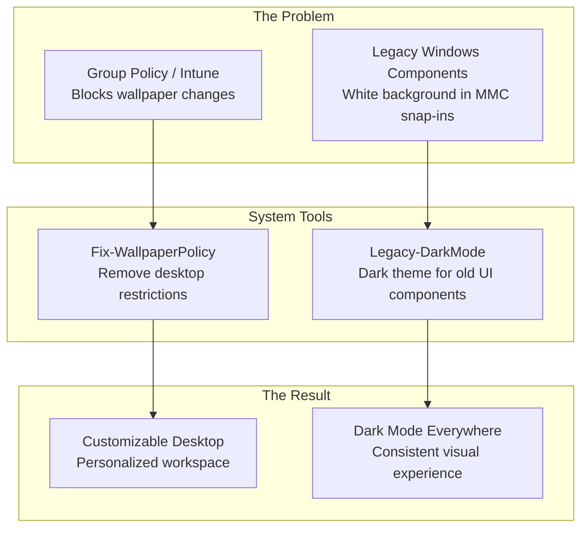

# System Tools — Making Windows Servers Look and Work the Way They Should

## What These Tools Do

Imagine you just moved into a new office. The IT department has set up your computer, but the wallpaper is locked to the company logo (which is fine for most people, but you spend 12 hours a day staring at that screen), and every management console — Task Scheduler, Event Viewer, Services — still uses eye-straining white backgrounds even though you switched to dark mode three weeks ago.

These annoyances seem small, but they add up. Developers and administrators spend more time looking at screens than almost anyone, and small usability improvements compound into significant productivity gains over a year.

The System Tools fix these Windows annoyances. They remove policies that block customization and apply dark mode to legacy Windows components that Microsoft forgot.

## Overview Diagram

## Tool-by-Tool Guide

### Fix-WallpaperPolicy — Removes corporate wallpaper lockdown

When companies use Microsoft Intune or Group Policy to manage devices, they often set wallpaper policies that prevent users from changing their desktop background. The Windows 11 Settings panel shows the wallpaper option grayed out with "Some of these settings are managed by your organization."

This tool removes two specific registry values under `HKLM:\SOFTWARE\Microsoft\Windows\CurrentVersion\Policies\Explorer`:
- **NoActiveDesktop** — Disables Active Desktop entirely
- **NoActiveDesktopChanges** — Blocks all wallpaper/desktop background changes

After removal, it restarts Explorer so changes take effect immediately without requiring a logout.

Safety features:
- **CheckOnly mode** — Report current state without making changes
- **NoRestartExplorer option** — Remove policies but skip the Explorer restart
- Clearly warns that Intune may re-apply the restriction on the next policy sync cycle

Think of it as the janitor who has the master key to unlock the thermostat cover so you can set your own temperature.

**Who needs it:** Any employee on a managed Windows device who wants to personalize their desktop. Particularly valued by developers and admins who spend all day at their screens.

**Can it be sold standalone?** No — small utility, but addresses a common frustration in managed enterprise environments. Could be included in a "Developer Workstation Setup" bundle.

---

### Legacy-DarkMode — Dark theme for Windows components that Microsoft forgot

Windows 11 has a dark mode toggle, but it only affects modern UWP/WinUI applications. Classic Win32 components — MMC snap-ins (Task Scheduler, Event Viewer, Services, Computer Management), legacy dialogs, and system tools — remain blindingly white.

This tool modifies Windows registry color settings to apply dark mode styling to these legacy components:

Features:
- **JSON-configurable themes** — Reads color definitions from `theme-config.json`, making it easy to create custom color schemes
- **Automatic backup** — Saves current color settings before making changes, enabling perfect restoration
- **Revert capability** — Restores original colors from backup with `-Revert`
- **Factory reset** — Reset to Windows 11 standard light theme with `-ResetToDefault`
- **Explorer restart** — Optional immediate refresh without logout via `-RestartExplorer`
- **Applies to**: Window background, button faces, scrollbar colors, menu colors, highlight colors, and text colors across all legacy Win32 components

Think of it as hiring an interior designer who can repaint the old wing of the building to match the modern renovation.

**Who needs it:** System administrators and developers who use MMC snap-ins daily and want consistent dark mode. Anyone who works late hours and suffers from eye strain caused by legacy white interfaces.

**Can it be sold standalone?** Moderate — dark mode for legacy Windows is a genuinely unmet need. There are few tools that solve this problem well. Could be distributed as a free tool for brand awareness or bundled with a developer toolkit.

---

## Revenue Potential

| Revenue Tier | Tools | Est. Annual Value |
|---|---|---|
| **Brand Building** | Both tools as free downloads | Brand awareness, lead generation |
| **Bundle Component** | Included in "Developer Workstation Setup" suite | $10K–$30K as part of a larger product |
| **Enterprise Deployment** | Deployed via Intune/SCCM to all developer workstations | $5K–$15K as managed service add-on |

These tools are not significant revenue generators on their own, but they serve an important role: they demonstrate attention to the developer experience, and they are the kind of "quality of life" tools that make people remember a brand positively.

## What Makes This Special

1. **Solves a real, widely-felt frustration** — Ask any system administrator about legacy MMC snap-ins in dark mode and you will hear the same complaint. Microsoft has not fixed this in over a decade. Legacy-DarkMode fills a genuine gap.

2. **Safe and reversible** — Both tools are designed with rollback in mind. Fix-WallpaperPolicy has CheckOnly mode. Legacy-DarkMode creates automatic backups and has full revert capability. No permanent changes, no risk.

3. **Enterprise-grade approach to small problems** — These are not quick registry hacks pasted from a forum. They have proper parameter handling, error checking, logging, documentation, and deployment support. This level of polish on utility tools reflects engineering standards across the entire product line.

4. **Deployment-ready** — Both tools include `_deploy.ps1` files for distribution across server fleets. They can be pushed to every machine in the organization in one operation.
