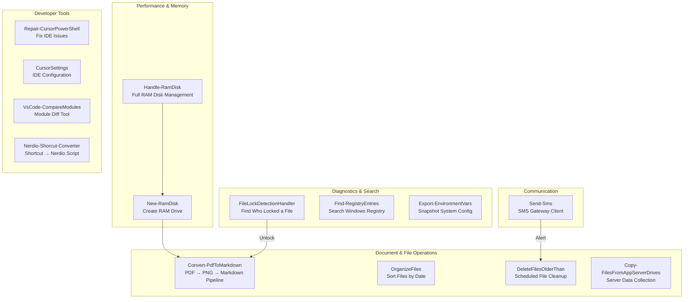

# Utility Tools — The Swiss Army Knife Drawer for IT Operations

## What These Tools Do

Every good workshop has a drawer full of specialized tools. Not the big power tools that do the headline work, but the measuring tapes, the wire strippers, the voltage testers, and the label makers that get pulled out dozens of times a day. Without them, every task takes longer, requires workarounds, or simply does not get done properly.

The Utility Tools are that drawer. These 14 tools handle everyday IT operations tasks: converting documents, finding locked files, creating lightning-fast RAM disks, exporting system configurations, sending SMS alerts, managing developer IDE settings, detecting file locks, searching the Windows registry, organizing files, and comparing code modules. Each one solves a specific problem that IT teams encounter repeatedly.

## Overview Diagram

## Tool-by-Tool Guide

### Convert-PdfToMarkdown — Turns PDFs into searchable, editable text

A complete document conversion pipeline: PDF → PNG (high-resolution page images) → Markdown (with OCR text extraction). Feed it a folder of PDFs and it produces organized output with the original PDFs, page images, and clean Markdown documents.

Features:
- **Automatic dependency management** — Installs Python, required packages, and OCR tools if missing
- **Multi-page support** — Handles PDFs of any length
- **Configurable DPI** — Default 300 DPI for quality, adjustable up to 600+ for fine print
- **OCR extraction** — Reads text from scanned documents (not just digital PDFs)
- **Organized output** — Creates PDF/, PNG/, and MD/ subdirectories automatically

Think of it as a scanner operator who takes your binder of printed documents and turns them into Word files, keeping everything organized.

**Who needs it:** Anyone digitizing paper processes, ingesting vendor documentation, or needing to make PDFs searchable. Legal, compliance, and documentation teams.

**Can it be sold standalone?** Yes — document conversion pipelines are a recognized market. The end-to-end automation (install dependencies, convert, OCR, organize) differentiates it from basic converters.

---

### Copy-FilesFromAppServerDrives — Collects server files for analysis

Copies files from production application servers to a local analysis folder using robocopy, excluding log files and files larger than 100 MB. Useful when you need to examine what is actually deployed on a server without logging into it directly.

**Who needs it:** Developers comparing deployed versions against source, or auditors verifying server contents.

**Can it be sold standalone?** No — simple robocopy wrapper for a specific workflow.

---

### CursorSettings — Shared IDE configuration profiles

Stores and manages Cursor IDE (AI-powered code editor) settings profiles. Different team members or machines can sync to a shared configuration, ensuring consistent editor behavior across the team.

**Who needs it:** Development teams standardizing on Cursor IDE who want consistent settings.

**Can it be sold standalone?** No — configuration management for a specific IDE.

---

### DeleteFilesOlderThan — Scheduled cleanup with SMS notification

A scheduled task that deletes files older than a specified number of days from a given path, then sends an SMS notification reporting how many files were removed. Simple, reliable, and auditable.

**Who needs it:** Operations teams managing data retention on servers where log files, temporary files, or export files accumulate.

**Can it be sold standalone?** No — basic utility, though the SMS notification adds operational awareness.

---

### Export-EnvironmentVars — Snapshots your system configuration

Exports all Machine-level and User-level Windows environment variables to timestamped text files. Essential before making system changes — like photographing your desk arrangement before the office moves, so you can put everything back.

**Who needs it:** System administrators performing upgrades, migrations, or troubleshooting path/variable issues.

**Can it be sold standalone?** No — simple but useful diagnostic utility.

---

### FileLockDetectionHandler — Finds who is holding a file hostage

When you get "The file is in use by another process" and cannot figure out who is locking it, this tool investigates. It uses Sysinternals Handle utility and WMI queries to identify exactly which process has a file open, then offers to kill the process or wait for it to release.

Features:
- **Auto-downloads** Sysinternals Handle utility if not installed
- **Recursive scanning** — Check an entire folder tree for locked files
- **Multiple detection methods** — WMI process queries, file stream testing, and Handle utility
- **Requires admin** — because finding file handles requires elevated privileges

Think of it as a building security guard who can tell you exactly which person has the key to the room you need to enter.

**Who needs it:** Developers, administrators, and deployment scripts that encounter locked files. Essential for deployment automation where files need to be overwritten.

**Can it be sold standalone?** Moderate — file lock detection is a common need. Several commercial tools exist, but this one integrates well with PowerShell automation pipelines.

---

### Find-RegistryEntries — Searches the entire Windows registry

The Windows registry is a massive database of settings. Finding a specific value requires searching through hundreds of thousands of keys. This tool performs a deep recursive search across HKLM and HKCU, showing progress dots every 10,000 keys, and outputs all matching paths to a file you can review.

**Who needs it:** Administrators tracking down where a specific setting, path, or configuration value is stored in the registry.

**Can it be sold standalone?** No — basic utility. Registry search tools already exist, but this one works from the PowerShell command line.

---

### Handle-RamDisk — Complete RAM disk management suite

A unified management tool for RAM disks (ultra-fast virtual drives stored in memory). Supports five actions:
- **Install** — Download and install ImDisk driver silently
- **Create** — Create a new NTFS-formatted RAM disk (1–128 GB)
- **Remove** — Remove one or all RAM disks
- **List** — Show all active RAM disks
- **Status** — Check if a specific RAM disk exists

**Who needs it:** Developers needing fast temporary storage for compilation, testing, or data processing. AutoDoc and VisualCobol use RAM disks to accelerate their operations.

**Can it be sold standalone?** Moderate — RAM disk tools exist, but this one wraps ImDisk with a clean PowerShell interface and includes automatic installation.

---

### New-RamDisk — Quick RAM disk creation

The focused creation tool: creates a single RAM disk with automatic ImDisk download and installation if missing. Specify size (1–128 GB), drive letter, and optionally force-remove any existing disk on that letter. Like Handle-RamDisk but streamlined for the common "just give me a fast drive" use case.

**Who needs it:** Same as Handle-RamDisk — developers needing temporary high-speed storage.

**Can it be sold standalone?** No — subset of Handle-RamDisk functionality.

---

### Nerdio-Shorcut-Converter — Turns Windows shortcuts into Nerdio automation scripts

Nerdio Manager is a tool for managing Azure Virtual Desktop (AVD) environments. When migrating applications to AVD, Windows shortcuts (.lnk files) need to be converted to Nerdio Scripted Actions (.ps1 files with metadata).

This tool reads .lnk files, extracts target path, arguments, working directory, hotkey, icon, and description, then generates:
- **CMD batch files** — For direct testing
- **PS1 scripts** — Ready to import into Nerdio Manager as Scripted Actions
- **Metadata files** — With all original shortcut properties
- **README** — Documentation of everything generated

Think of it as a translator that takes the quick-launch buttons from an old Windows desktop and recreates them for a cloud-hosted virtual desktop.

**Who needs it:** Teams migrating on-premises Windows applications to Azure Virtual Desktop using Nerdio Manager.

**Can it be sold standalone?** Yes — niche but high-value for Nerdio/AVD migration projects. Few tools automate this specific conversion.

---

### OrganizeFiles — Sorts files into date-based folders

Takes a folder full of files (like a Downloads folder) and automatically organizes them into subfolders named by date (YYYY-MM-DD). Skips today's files so you do not accidentally move something you are still working on. Runs as a scheduled task for hands-free organization.

**Who needs it:** Anyone whose Downloads folder looks like a bomb went off. Also useful for organizing log output, report files, or data exports.

**Can it be sold standalone?** No — simple utility, though the "skip today" logic shows thoughtful design.

---

### Repair-CursorPowerShell — Fixes broken IDE language server

When the Cursor IDE's PowerShell extension starts showing phantom linter errors (red squiggles on code that is actually correct), this tool diagnoses and fixes the issue. Four repair actions:
- **KillLanguageServer** — Force-restart the PowerShell Editor Services process
- **UpdateExtension** — Check for and install the latest PowerShell extension
- **UpdatePowerShell** — Update PowerShell 7 via winget
- **ClearDiagnosticsCache** — Clear stale logs, workspace storage, and PSScriptAnalyzer caches

**Who needs it:** Developers using Cursor IDE with PowerShell who experience phantom linter errors.

**Can it be sold standalone?** No — Cursor IDE-specific repair tool. However, it demonstrates deep understanding of IDE internals.

---

### Send-Sms — SMS gateway for automated notifications

A simple, clean interface to send SMS messages via the organization's SMS gateway. Supports multiple recipients (comma-separated phone numbers) with international format (+47XXXXXXXX). Used by other tools (DeleteFilesOlderThan, MicroFocus-SOA-Status) to send operational alerts.

**Who needs it:** Any automated process that needs to alert a human via text message: server failures, batch job completions, disk space warnings.

**Can it be sold standalone?** No — thin wrapper around the SMS module. The value is in the integration with other tools.

---

### VsCode-CompareModules — Compares deployed vs. source modules

Sets up a VS Code diff workspace to compare module files between the local source repository and what is actually deployed on servers. Helps identify drift — when deployed code does not match source control.

**Who needs it:** Teams verifying that deployments are consistent with source control.

**Can it be sold standalone?** No — environment-specific comparison workflow.

---

## Revenue Potential

| Revenue Tier | Tools | Est. Annual Value |
|---|---|---|
| **High — Productizable** | Convert-PdfToMarkdown, Nerdio-Shorcut-Converter | $50K–$150K each as specialized tools |
| **Medium — Bundle Value** | FileLockDetectionHandler, Handle-RamDisk | $30K–$80K as "Developer Productivity Suite" |
| **Consulting Accelerator** | All 14 tools as "IT Operations Toolkit" | $100K–$300K per enterprise deployment |
| **Operational Savings** | Send-Sms + DeleteFilesOlderThan + LogFile-Remover | Prevents 5–10 outages/year at $10K–$50K each |

The real value of utility tools is not in selling them individually — it is in the cumulative time they save. If each tool saves 30 minutes per week across a 20-person team, that is over 700 hours per year.

## What Makes This Special

1. **Self-healing automation** — Tools like New-RamDisk automatically download and install dependencies (ImDisk). FileLockDetectionHandler downloads Sysinternals tools. Convert-PdfToMarkdown installs Python and packages. The tools fix their own prerequisites.

2. **Operational awareness** — DeleteFilesOlderThan sends SMS when cleanup runs. MicroFocus-SOA-Status texts when threads are high. This pattern of "do the job, then tell someone about it" turns silent automation into visible operations.

3. **Nerdio conversion fills a gap** — The Nerdio-Shorcut-Converter solves a very specific, very tedious migration problem. Converting hundreds of Windows shortcuts to Nerdio Scripted Actions by hand takes days; this tool does it in minutes.

4. **IDE repair expertise** — Repair-CursorPowerShell shows deep knowledge of the PowerShell Editor Services architecture, PSES process management, and VSCode/Cursor extension lifecycle. This kind of tooling prevents developer downtime from IDE issues.

5. **Defense in depth for files** — Between FileLockDetectionHandler (who has the file?), DeleteFilesOlderThan (clean up old files), OrganizeFiles (sort by date), and Copy-FilesFromAppServerDrives (collect for analysis), the toolkit covers the entire file lifecycle.
