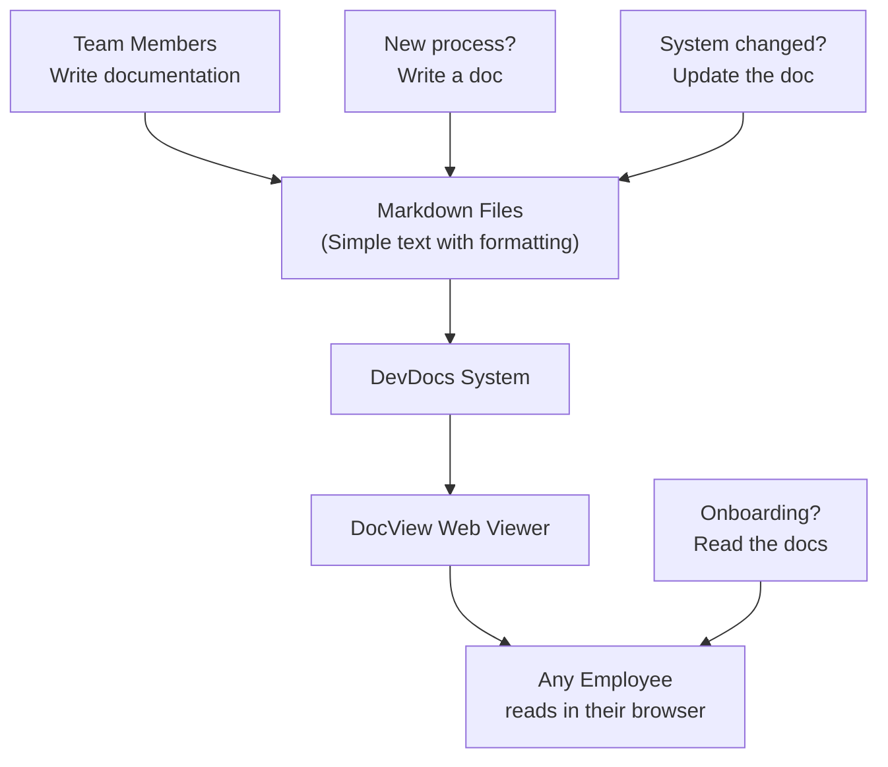

# DevDocs — Your Company's Internal Wikipedia for Developers

## What It Does (The Elevator Pitch)

Every company has institutional knowledge — the unwritten rules, the "ask Steve, he knows how the billing system works," the tribal knowledge that lives in people's heads and gets lost when they leave. **DevDocs** captures all of that knowledge in one searchable, browsable place.

It's an internal knowledge base (a company encyclopedia) where teams write documentation in simple text files, and those files are automatically published to a clean, professional web viewer called **DocView** that anyone in the organization can access through their browser — no special software needed.

## The Problem It Solves

In most organizations, critical knowledge is scattered across:
- Random Word documents on shared drives
- Chat messages buried in conversation history
- Emails that only one person received
- The heads of senior employees who might leave tomorrow

When someone needs to know "How do we set up a new customer account?" or "What's the process for deploying to production?", they spend hours hunting or, worse, they guess and get it wrong.

DevDocs centralizes all of this. Write it once, publish it to the web, and everyone can find it instantly.

## How It Works

Here's the step-by-step:

1. **Writers create documents** — Using Markdown (a simple text format where `**bold**` makes text **bold** and `# Heading` creates a heading). No special tools needed — any text editor works.
2. **Documents are stored in a central folder** — All documentation lives in one organized location, tracked by version control (every change is recorded so you can see who wrote what and when).
3. **DevDocs publishes to DocView** — The system converts the simple text files into professional-looking web pages with navigation, search, and clean formatting.
4. **Anyone can read it** — Employees open their browser, go to the DocView URL, and browse or search the documentation. No installation, no login hassles — just information at their fingertips.

## Key Features

- **Write in plain text** — Documents use Markdown, a simple format that takes 10 minutes to learn. No complex authoring tools needed.
- **Automatic web publishing** — Save a file, and it appears on the web viewer automatically
- **Searchable** — Find any document or topic instantly through the web interface
- **Version-tracked** — Every edit is recorded. See who changed what, when, and why. Roll back mistakes easily.
- **Professional presentation** — DocView renders documents with clean typography, navigation menus, and a polished look
- **No special software** — Writers need only a text editor; readers need only a web browser
- **Organized structure** — Documents are organized in folders and categories for easy browsing

## How It Compares to Competitors

> **Note:** No competitor JSON file was found for this product. The comparison below is based on the general market landscape.

| Feature | DevDocs | Confluence | SharePoint | Notion | GitBook |
|---|---|---|---|---|---|
| **Ease of writing** | Simple text files | Web editor | Complex web editor | Web editor | Web/Markdown |
| **Works offline** | Yes (text files) | No | No | Limited | No |
| **Version control** | Git (full history) | Page history | Page history | Page history | Git |
| **Self-hosted** | Yes | Server edition | Yes | No (cloud only) | Cloud or self-hosted |
| **Learning curve** | Minimal | Moderate | High | Low | Low |
| **Cost** | License fee | $6–$12/user/month | Part of Microsoft 365 | $8–$15/user/month | $6.70+/user/month |
| **Search quality** | Good | Good | Moderate | Good | Good |

**Key takeaway:** Cloud tools like Confluence and Notion require internet access and per-user fees that add up quickly. SharePoint is powerful but complex. DevDocs offers a simpler, self-hosted alternative that keeps documentation inside the company network with zero per-user costs.

## Screenshots

## Revenue Potential

### Licensing Model
- **Per-organization license** — flat fee, no per-user charges
- **Bundled with other Dedge products** as a documentation layer

### Target Market
- **Any organization** with 10+ technical staff that needs centralized documentation
- **Companies with compliance requirements** that need auditable, version-controlled documentation
- **Organizations leaving cloud tools** (Confluence, Notion) to reduce costs or keep data on-premises

### Revenue Drivers
- The average company wastes 5–10 hours per employee per month searching for information. At $50/hour, that's $3,000–$6,000 per employee per year
- Compliance-driven industries need auditable documentation — DevDocs with Git provides a complete audit trail
- Per-user SaaS fatigue: organizations with 500 employees paying $10/user/month for Confluence spend $60,000/year — a flat license is immediately attractive

### Estimated Pricing
- **Small team** (up to 50 users): $2,000/year
- **Organization** (up to 500 users): $5,000/year
- **Enterprise** (unlimited): $10,000/year

## What Makes This Special

1. **Radical simplicity** — While competitors add features until their products need training courses, DevDocs stays simple: write text, see it on the web. Anyone who can write an email can contribute documentation.
2. **No per-user fees** — Unlike Confluence ($12/user/month) or Notion ($15/user/month), DevDocs is a flat organizational license. For a 200-person team, that difference is $28,800–$36,000 per year.
3. **Self-hosted and private** — Documentation never leaves the company network. No cloud provider has access to your internal processes, architecture, or institutional knowledge.
4. **Git-powered audit trail** — Every change is tracked with who, what, when, and why — not just page-level history, but line-by-line diffs. This meets compliance requirements that wiki-style tools cannot.
5. **Offline-first** — Writers can work without internet. Documents are just text files that sync when connectivity returns. Critical for organizations with restricted networks or remote workers in low-connectivity areas.
