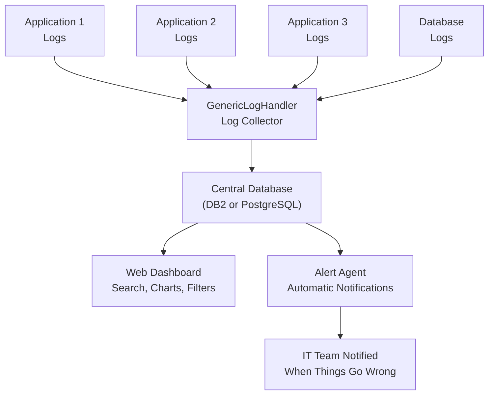

# GenericLogHandler — The Centralized Security Camera for All Your Software Events

## What It Does (The Elevator Pitch)

GenericLogHandler collects the activity records from *every* application in your organization into one searchable place, with a visual dashboard and automatic alerts when something goes wrong. Think of it as a centralized security camera system — but instead of watching hallways, it watches every piece of software, and immediately flags suspicious activity.

## The Problem It Solves

Every software application generates logs — records of everything it did. "User John logged in at 9:03 AM." "Payment of $4,500 processed at 9:04 AM." "Error: could not connect to database at 9:05 AM." These logs are critical for troubleshooting, security audits, and compliance — but in most organizations, they're scattered across dozens of servers in dozens of different formats.

When something goes wrong — a server crashes, a transaction fails, a security breach is suspected — the IT team has to manually log into each server, find the relevant log files, and piece together what happened. It's like trying to solve a crime by watching 50 separate security camera feeds stored in 50 different buildings, each recorded in a different video format.

**The real-world analogy:** Imagine a shopping mall where every store has its own security cameras, but none of them connect to a central control room. When something happens, the security team has to physically visit each store, rewind each tape, and manually look for clues. Now imagine all those cameras feeding into one control room with one screen, one search bar, and automatic alerts when something unusual appears on any camera. That's GenericLogHandler for your software.

## How It Works

GenericLogHandler works in three layers. The **Collection** layer gathers log entries from every application in your organization. It doesn't matter what format the logs are in or which server they're on — the collector normalizes everything into a consistent structure and stores it in a central database (either IBM DB2 or PostgreSQL, whichever your organization already uses — no need to buy new database infrastructure).

The **Dashboard** layer provides a web-based interface where IT staff and managers can search, filter, and visualize all log data. Want to see every error from the last 24 hours across all applications? One search. Want to know how many transactions processed successfully yesterday? One chart. Want to trace a specific user's activity across multiple systems? One filter. The dashboard includes interactive charts showing trends over time — error rates, throughput, response times.

The **Alert Agent** layer continuously watches incoming logs for patterns that indicate problems. If error rates spike, if a critical application stops logging (often a sign it has crashed), or if any predefined warning condition is met, the alert agent notifies the IT team immediately. This transforms log monitoring from reactive ("something broke, let's investigate") to proactive ("something's about to break, let's prevent it").

## Key Features

- **Collects from every application** — any software that writes log files can feed into GenericLogHandler, regardless of format or platform
- **Centralized searchable database** — one place to search all logs, replacing the chaos of dozens of scattered log files
- **Web dashboard with charts** — visual overview of system health, error trends, and application activity — accessible from any browser
- **Automatic alert agent** — get notified immediately when error patterns, outages, or unusual activity are detected
- **Uses your existing database** — stores logs in DB2 or PostgreSQL, no need to license, install, or maintain a separate log database
- **Historical retention** — keep months or years of log history for compliance, auditing, and trend analysis
- **Fast search** — find specific events across millions of log entries in seconds
- **No per-gigabyte pricing** — unlike cloud log services that charge by volume, GenericLogHandler has a flat license cost regardless of how much you log

## How It Compares to Competitors

| Feature | **Dedge GenericLogHandler** | Splunk | Graylog | ELK Stack | Seq | Grafana Loki | OpenObserve |
|---|---|---|---|---|---|---|---|
| **Setup complexity** | Simple | Complex | Moderate | Complex (3 services) | Simple | Moderate | Moderate |
| **Uses existing DB2/PostgreSQL** | Yes | No (proprietary) | No (needs MongoDB + ES) | No (Elasticsearch) | No (proprietary) | No (custom) | No (custom) |
| **Web dashboard** | Built-in | Yes | Yes | Yes (Kibana) | Yes | Yes (Grafana) | Yes |
| **Alert agent** | Built-in | Yes | Yes | Requires config | Yes | Requires Grafana | Yes |
| **Full-text search** | Yes | Yes | Yes | Yes | Yes | No (labels only) | Yes |
| **Windows-native** | Yes | Yes | Linux-focused | Linux-focused | Yes | Linux-focused | Linux-focused |
| **Pricing** | One-time license | ~$150/GB/day | Free–$1,250/month | Free (complex) | Free–$7,990/year | Free (complex) | Free (complex) |

**Dedge's advantage:** The most striking difference is infrastructure requirements. Splunk, Graylog, and ELK all require their own dedicated database infrastructure — Elasticsearch clusters, MongoDB instances, or proprietary storage — which means additional licensing, hardware, and maintenance costs. GenericLogHandler uses your *existing* DB2 or PostgreSQL database, eliminating an entire layer of infrastructure complexity and cost. For Windows-centric enterprises already running DB2, this means going from "no centralized logging" to "fully operational log management" with near-zero infrastructure investment. The built-in alert agent also means no separate alerting tool is needed — unlike ELK and Loki, which require additional configuration or tools.

## Screenshots

## Revenue Potential

**Target Market:** Any mid-to-large enterprise that needs centralized logging but finds Splunk too expensive and ELK too complex. Particularly attractive to organizations already running DB2 or PostgreSQL who don't want to introduce new database infrastructure. Strong fit for regulated industries (banking, healthcare, government) where log retention is a compliance requirement.

**Pricing Model Ideas:**

| Tier | Price | Includes |
|---|---|---|
| **Starter** | $4,000 one-time + $800/year | Up to 5 applications, 90-day retention, basic alerts |
| **Professional** | $10,000 one-time + $2,000/year | Up to 25 applications, 1-year retention, advanced alerts, charts |
| **Enterprise** | $25,000 one-time + $5,000/year | Unlimited applications, unlimited retention, custom alerts, API access |

**Revenue Projection:** The log management market exceeds $4 billion annually, with Splunk alone generating $3.8B in revenue — largely because alternatives are either too complex or too limited. GenericLogHandler targets the massive "Splunk-is-too-expensive" segment. With 150 enterprise customers at the Professional tier, annual revenue reaches $300K recurring plus $1.5M in licenses. The compliance angle (banking, healthcare, government *must* retain logs) creates a strong retention driver.

## What Makes This Special

1. **Zero new infrastructure.** The single biggest barrier to centralized logging is the infrastructure requirement — Elasticsearch clusters, MongoDB instances, dedicated storage. GenericLogHandler removes that barrier entirely by using your existing DB2 or PostgreSQL database. From zero to operational in hours, not weeks.

2. **Flat pricing, not per-gigabyte.** Splunk's per-GB pricing model punishes organizations for logging more — which is exactly the opposite of what good practice demands. GenericLogHandler's flat license means you can log everything, retain everything, and search everything without worrying about surprise bills.

3. **Built-in alert agent, not an afterthought.** The alert agent isn't a separate product or a complex add-on — it's a core component that watches log streams in real time. When errors spike or applications go silent, your team knows immediately.

4. **Windows-native in a Linux-dominated market.** Most log management tools assume a Linux/Kubernetes environment. GenericLogHandler is built for the reality of many enterprises: Windows Server fleets running business-critical applications with DB2 databases.
