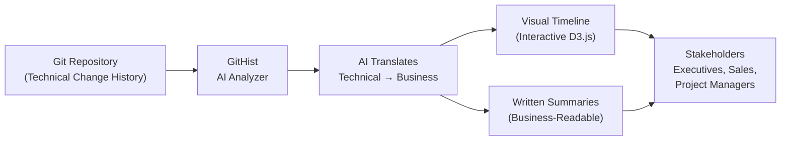

# GitHist — The Storyteller for Your Development Team's Work

## What It Does (The Elevator Pitch)

GitHist takes the technical record of every code change your development team has ever made and transforms it into beautiful, business-readable summaries and visual timelines. It answers the question every executive asks: "What has the development team actually built, and when?" — without anyone needing to understand code.

## The Problem It Solves

Development teams track every code change in a system called Git (a version history system — think of it as "Track Changes" in Microsoft Word, but for software). Git records thousands of entries: who changed what, when, and a brief note about why. But these entries are written in developer shorthand — "refactored auth middleware," "fixed NPE in batch handler," "merged feature/billing-v2" — meaningless to anyone outside the engineering team.

When a CTO needs to report to the board on development progress, when a project manager needs to justify the team's time, or when a sales team wants to show customers what's been improved, someone has to manually translate months of cryptic Git entries into business language. This translation takes hours, introduces human bias, and is usually so painful that it simply doesn't happen — leaving stakeholders in the dark about what the development team is actually delivering.

**The real-world analogy:** Imagine a construction company that keeps detailed records of every brick laid, every pipe fitted, every wire connected — but has no way to tell the building owner "Here's what we built this month" in simple terms. The owner sees thousands of line items like "fitted 3/4" copper T-junction, section B-7" and has no idea whether the project is on track. GitHist is like hiring a project storyteller who reads all those technical records and produces a beautiful progress report with timelines, milestones, and clear descriptions of what was accomplished.

## How It Works

GitHist works in two stages. First, the **AI Translation** stage: GitHist reads through all the Git history entries (called "commits" — each one is a snapshot of a code change with a developer's note attached) and uses artificial intelligence to understand what each change represents in business terms. "Fixed NPE in batch handler" becomes "Resolved a crash in the nightly billing process that was causing incomplete invoices." "Merged feature/billing-v2" becomes "Completed the new flexible billing system that supports monthly and annual payment plans."

Second, the **Visualization** stage: the translated summaries are assembled into interactive timelines built with D3.js (a leading visualization library used by organizations like The New York Times and NASA for data graphics). These timelines show what was built, when it was built, and how effort was distributed over time. You can zoom into any week, click on any milestone, and see the business-language description of what happened.

The result is a communication tool that bridges the gap between the engineering team (who know what they built) and everyone else in the organization (who need to understand what was built, without learning to code).

## Key Features

- **AI-powered translation** — automatically converts technical developer notes into clear business English
- **Interactive D3.js timelines** — beautiful, clickable visual timelines showing development progress over any time period
- **Business-readable summaries** — written reports that a CEO, sales representative, or project manager can understand without any technical background
- **Historical coverage** — analyzes your complete Git history, not just recent changes, so you can produce progress reports for any time period
- **Milestone detection** — AI identifies significant accomplishments (new features, major fixes, system upgrades) and highlights them on the timeline
- **Exportable reports** — generate timelines and summaries that can be included in board presentations, customer proposals, or project reports
- **Works with any Git repository** — language-agnostic; whether your team writes COBOL, C#, Python, or JavaScript, GitHist reads the history

## How It Compares to Competitors

| Feature | **Dedge GitHist** | SumGit | Git History Visualizer | What The LOG | Git Commits Threadline | Repository Timeline |
|---|---|---|---|---|---|---|
| **AI business translation** | Yes (local AI) | Yes (cloud AI) | No | Planned | No | No |
| **Interactive D3.js timelines** | Yes | No (3D storybooks) | Yes (6 panels) | No | Yes (force-directed) | Yes (15 chart types) |
| **Business-readable output** | Core focus | Partial (dev-oriented) | Developer-focused | Developer-focused | Artistic/visual | Chart-focused |
| **Runs locally / on-premise** | Yes | Cloud SaaS | Yes | Cloud SaaS | Yes | Yes |
| **Pricing** | One-time license | $9–$19/month + credits | Free | Free–$9/month | Free | Free |
| **Stakeholder-ready exports** | Yes | Widget embeds | No | No | No | PNG export |

**Dedge's advantage:** GitHist is the only tool purpose-built for *business stakeholder communication*. Every competitor either targets developers (Git History Visualizer, Threadline), uses developer-oriented output formats (What The LOG generates CHANGELOG.md files), or charges per-use cloud credits (SumGit). GitHist is designed from the ground up to answer the business question — "What did we accomplish?" — with AI running locally (no cloud dependency, no credit limits, no data leaving your organization), and D3.js timelines that are presentation-ready for boardrooms.

## Screenshots

## Revenue Potential

**Target Market:** Development organizations of all sizes that need to communicate technical progress to non-technical stakeholders. This includes: CTOs reporting to boards, project managers tracking delivery, consulting firms demonstrating value to clients, regulated industries that must document all software changes for compliance, and sales teams creating "what's new" materials.

**Pricing Model Ideas:**

| Tier | Price | Includes |
|---|---|---|
| **Team** | $2,000 one-time + $400/year | Up to 5 repositories, AI summaries, timeline exports |
| **Organization** | $6,000 one-time + $1,200/year | Up to 25 repositories, custom branding, presentation exports |
| **Enterprise** | $15,000 one-time + $3,000/year | Unlimited repositories, API access, custom AI prompts, integration with Dedge ecosystem |

**Revenue Projection:** There are an estimated 100 million developers worldwide using Git, organized into millions of development teams — nearly all of whom face the "what did we build?" communication challenge. While most free tools target developers, GitHist targets the *business side* — a much less crowded market. At 500 Team/Organization licenses in year one (very conservative for a global market), revenue would reach $2M+ in licenses and $400K+ in recurring support.

## What Makes This Special

1. **Bridges the communication gap that every tech company has.** The #1 complaint from non-technical executives about development teams is "I don't know what they're doing." GitHist makes that problem disappear by automatically translating technical records into business language.

2. **AI runs locally — no credit limits, no cloud risk.** Unlike SumGit (which charges per-credit for AI analysis), GitHist runs AI locally with no usage limits. Analyze your entire 10-year Git history without worrying about costs. And your code history — which often contains sensitive information about business logic and architecture — never leaves your servers.

3. **D3.js timelines are presentation-grade.** The visual output isn't a developer's debug chart — it's a polished, interactive timeline designed to be projected in a boardroom or embedded in a quarterly report. First impressions matter, and GitHist makes the development team look organized and productive.

4. **Works with your entire history.** Most tools focus on recent changes. GitHist can analyze years of Git history to show the complete evolution of a project — invaluable for acquisitions (due diligence on what was built), compliance (audit trail), or simply celebrating how far you've come.
