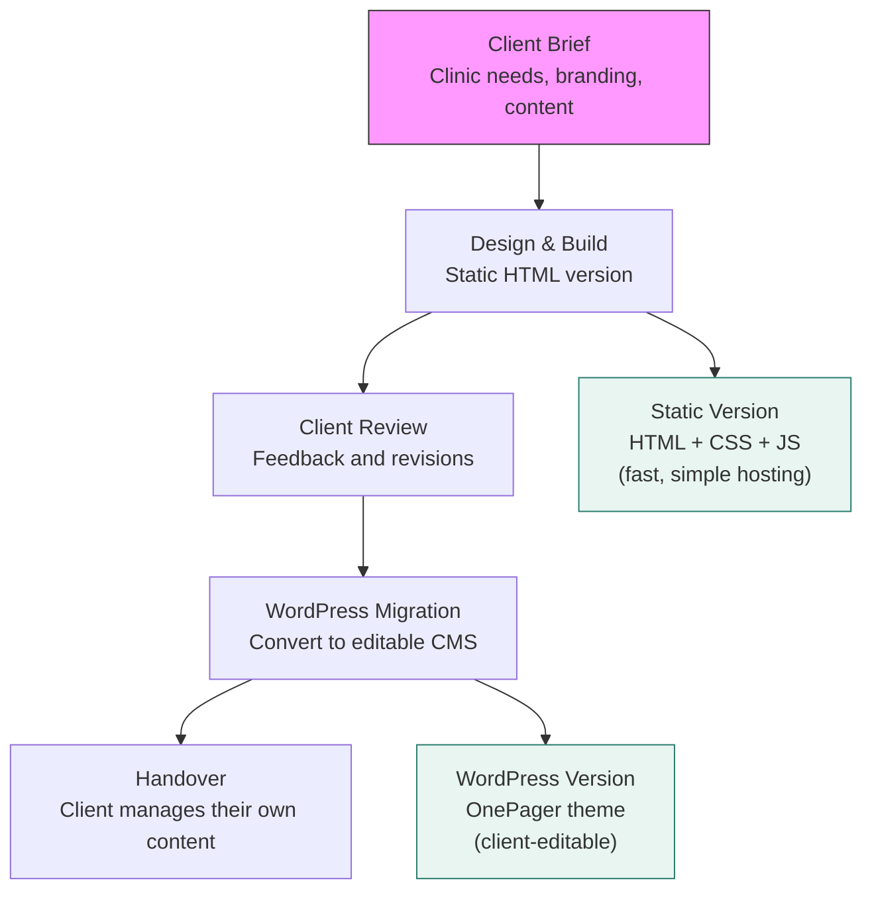

# Lillestrøm Osteopati — A Real-World Client Website for a Healthcare Clinic

## What It Does (The Elevator Pitch)

Lillestrøm Osteopati is a complete, professional website built for a real osteopathy clinic in Lillestrøm, Norway. It exists in two versions: a lightweight static website (pure HTML/CSS/JavaScript) and a full WordPress version using the OnePager theme. Together, they demonstrate Dedge's ability to deliver polished, client-ready websites — from initial design to deployment.

This is not a template or a demo. It's a live client delivery for [lillestrom-osteopati.no](https://lillestrom-osteopati.no/).

## The Problem It Solves

Small healthcare businesses like physiotherapy clinics, osteopathy practices, and dental offices face a common challenge:

- They need a **professional web presence** to attract patients
- They can't afford **$5,000–$15,000** for a custom website
- They don't have the technical skills to build one themselves
- Generic template sites look **unprofessional and interchangeable**

Lillestrøm Osteopati demonstrates that a beautiful, content-rich, professional clinic website can be built quickly and affordably — and then maintained by the client themselves (in the WordPress version) without ongoing developer involvement.

## How It Works

**The two versions explained:**

### Version 1: Static HTML Site

A single-page website built with plain HTML, CSS, and JavaScript. No frameworks, no build tools, no server-side processing.

- **Fastest possible load time** — nothing is faster than static HTML
- **Cheapest possible hosting** — any basic web host works (the client uses Domeneshop, a Norwegian provider)
- **Zero maintenance** — no updates, no security patches, no database
- **Limitation** — the client needs a developer to make content changes

### Version 2: WordPress Site

The same design and content, rebuilt as a WordPress theme using the OnePager theme engine. This gives the client full control.

- **Client edits their own text** — through the WordPress Customizer, no coding required
- **Dynamic content** — team members, services, and FAQ entries are managed through the WordPress admin panel
- **Contact form integration** — uses Contact Form 7, a popular free WordPress plugin
- **Norwegian admin guide included** — a user manual ("Brukerveiledning") written in Norwegian for the clinic staff

## Key Features

| Feature | What It Means |
|---|---|
| **10 content sections** | Hero, About, Osteopathy types, Treatments, Process, Practitioners, Insurance, Pricing, Contact, FAQ |
| **Norwegian language** | All content in Norwegian — proper medical terminology, not machine-translated |
| **Insurance information** | Dedicated section explaining health insurance coverage with partner company logos |
| **Corporate/B2B section** | Workplace osteopathy offering with business benefits, tax deduction info, and sick leave statistics |
| **Practitioner profiles** | Detailed bios with education, credentials, and specialty areas |
| **12 treatment categories** | Back pain, headache, sports injuries, pregnancy, children, office strain, and more |
| **First-visit walkthrough** | 4-step process explaining what happens at a first consultation — reduces patient anxiety |
| **Contact form** | Working form with spam protection, email notification, and thank-you redirect |
| **Fully responsive** | Beautiful on mobile phones, tablets, and desktop screens |
| **Scroll animations** | Smooth reveal effects as visitors scroll down the page |
| **No tracking or cookies** | Privacy-friendly — no analytics, no third-party trackers |

## How It Compares to Competitors

Since there is no competitor research file for this product, here is a comparison against common alternatives for clinic websites:

| Approach | Cost | Time to Launch | Client Can Edit? | Performance |
|---|---|---|---|---|
| **Dedge delivery (static + WordPress)** | Affordable project fee | 1–2 weeks | Yes (WordPress version) | Excellent |
| Squarespace / Wix | $16–$49/month ongoing | 1–3 days (template) | Yes (limited) | Medium |
| Custom agency build | $5,000–$15,000 | 4–12 weeks | Depends on CMS | Varies |
| DIY WordPress + free theme | Free (+ hosting) | 1–4 weeks (learning curve) | Yes | Medium |
| Facebook page only | Free | 1 hour | Yes (limited) | N/A |

**Where the Dedge approach wins:**
- **Two versions for the price of one** — the client gets both a static version (for maximum speed) and a WordPress version (for self-service editing).
- **Domain-specific content** — not a generic clinic template but content written with proper Norwegian healthcare terminology and real regulatory information (e.g., osteopath authorization since 2022, Helfo coverage rules).
- **No ongoing fees** — unlike Squarespace or Wix, there are no monthly platform fees beyond basic hosting.
- **Norwegian user manual** — the client gets a guide in their own language, not English documentation.

## Screenshots

## Revenue Potential

| Revenue Model | Details |
|---|---|
| **Client project fee** | One-time project delivery fee for design, development, and deployment |
| **Repeatable template** | The same approach (static + WordPress) can be reused for other clinics, reducing build time to days |
| **Maintenance retainer** | Monthly fee for hosting, backups, updates, and minor content changes |
| **Portfolio piece** | Real-world client work that demonstrates capability to future prospects |
| **Industry vertical** | Healthcare clinics are an underserved market — most have poor websites or none at all |

**Scalability:** Once the OnePager theme and delivery process are proven, spinning up a new clinic website takes 1–3 days of content work. The design, theme, hosting setup, and deployment process are already solved.

## What Makes This Special

1. **It's real.** This isn't a concept or a mockup. It's a working website for a real business with real patients. That credibility matters when pitching to new clients.

2. **Dual-format delivery is smart business.** The static HTML version launches fast and costs nothing to host. The WordPress version empowers the client to make their own changes. Offering both gives the client flexibility and reduces Dedge's ongoing support burden.

3. **Healthcare-specific content quality.** The website includes accurate medical information about osteopathy types (parietal, visceral, cranial), Norwegian healthcare regulations, insurance partner details, and proper medical terminology. This isn't generic filler text — it's content that builds trust with patients.

4. **The B2B corporate section is a revenue multiplier.** The website doesn't just target individual patients — it pitches workplace osteopathy to businesses with detailed cost-benefit data (e.g., "SINTEF estimates companies lose 13,000 NOK per week per sick employee"). This opens a second revenue stream for the clinic.

5. **Privacy by design.** No cookies, no tracking, no third-party dependencies beyond fonts and icons. In healthcare, this is particularly important and increasingly required by regulators.
