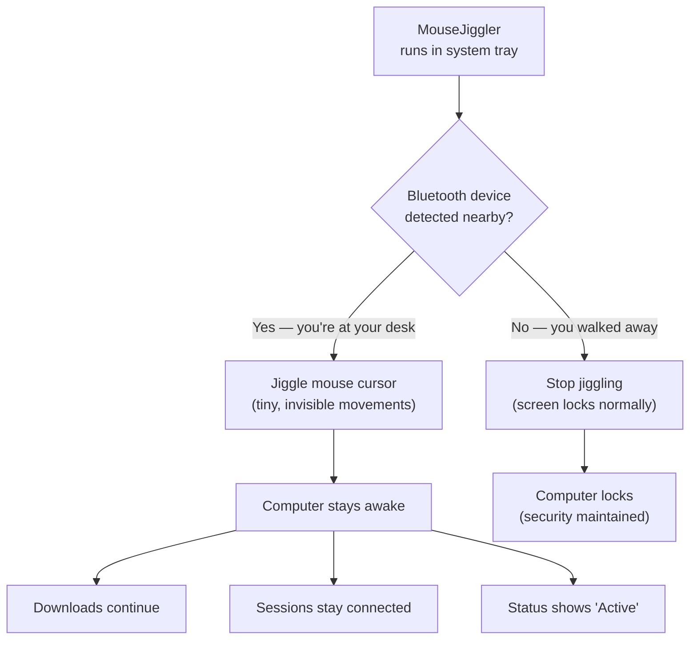

# MouseJiggler — Keep Your Computer Awake, Intelligently

## What It Does (The Elevator Pitch)

You know that frustrating moment when you step away from your desk for two minutes to grab coffee, and your computer locks itself? Your download stops. Your remote desktop session disconnects. Your video call drops. You come back and spend the next 5 minutes logging back in and reopening everything.

**MouseJiggler** prevents this by gently moving your mouse cursor — so small you won't notice, but enough to tell your computer "I'm still here." It runs silently in the system tray (the small icon area near your clock) and requires zero attention.

But here's what makes it special: **Bluetooth proximity detection**. Pair it with your phone or a Bluetooth device, and it knows when you're nearby. Walk away? It stops jiggling (so your screen locks naturally for security). Come back? It resumes automatically. Intelligent, hands-free, and secure.

## The Problem It Solves

Corporate IT policies often enforce aggressive screen timeouts — lock after 5 or 10 minutes of inactivity. While well-intentioned for security, this creates real productivity problems:
- **Long-running tasks get interrupted** — Downloads, file transfers, database operations, and software installations stop when the screen locks
- **Remote desktop sessions disconnect** — IT administrators managing servers lose their sessions and have to reconnect and re-navigate to where they were
- **Video calls drop** — Presenting to a client and forgot to move your mouse? Screen locks mid-presentation.
- **Status appears "away"** — Collaboration tools (Teams, Slack) show you as "Away" even when you're reading a physical document at your desk

Existing solutions either don't actually move the mouse (PowerToys Awake only prevents sleep, not screen lock), are easily detected by monitoring software (basic jigglers), or require constant manual toggling.

MouseJiggler solves this with real mouse movement AND intelligent Bluetooth-based activation.

## How It Works

Here's the step-by-step:

1. **Install and forget** — MouseJiggler sits in your system tray (the small icon area by the clock). No window to manage, no buttons to click.
2. **Optional Bluetooth pairing** — Pair your phone, smartwatch, or any Bluetooth device. MouseJiggler uses this to detect your physical presence.
3. **When you're at your desk** — MouseJiggler moves the cursor by tiny amounts at regular intervals. The movements are imperceptible (you won't see the cursor jump around), but they're enough to keep the computer from going idle.
4. **When you walk away** — If Bluetooth proximity detection is enabled and your paired device goes out of range, MouseJiggler stops. Your normal screen lock kicks in, keeping your computer secure.
5. **When you return** — Your Bluetooth device comes back in range, and MouseJiggler resumes automatically. No need to manually toggle anything.

## Key Features

- **Invisible operation** — Runs silently in the system tray with no visible windows
- **Bluetooth proximity detection** — Automatically activates/deactivates based on whether you're physically nearby (pairs with phone, smartwatch, or any Bluetooth device)
- **Real mouse movement** — Moves the actual cursor (unlike tools that only prevent sleep mode), which keeps screen locks, remote sessions, and collaboration tools active
- **Configurable** — Adjust movement frequency and distance to suit your environment
- **Lightweight** — Minimal CPU and memory usage; you'll never notice it running
- **No admin rights required** — Installs and runs without IT department involvement in most environments

## How It Compares to Competitors

| Feature | Dedge MouseJiggler | Arkane MouseJiggler | Move Mouse | Caffeine | PowerToys Awake | Don't Sleep |
|---|---|---|---|---|---|---|
| **Bluetooth proximity** | Yes | No | No | No | No | No |
| **Real mouse movement** | Yes | Yes | Yes | No (keypress only) | No (power plan only) | No (power state only) |
| **Prevents screen lock** | Yes | Yes | Yes | Partially | No | No |
| **System tray operation** | Yes | Yes | Yes | Yes | Yes | Yes |
| **Automatic on/off** | Yes (Bluetooth) | Manual | Scheduled | Manual | Manual | Timer only |
| **Stealth operation** | Yes | Detectable | Detectable | Moderate | N/A | N/A |
| **Pricing** | License fee | Free | Free | Free | Free | Free |

**Key takeaway:** Every competitor is a simple "on/off" tool. MouseJiggler is the only one with Bluetooth proximity detection — it's intelligent enough to keep you active when you're at your desk AND secure when you walk away. This "smart security" angle is what justifies a premium over free alternatives.

## Screenshots

## Revenue Potential

### Licensing Model
- **Individual license** — one-time purchase
- **Team/enterprise license** — bulk pricing for organizations
- **Freemium** — basic jiggling free, Bluetooth proximity as paid feature

### Target Market
- **Remote workers** — Work-from-home employees who need to stay "active" during long reading sessions, phone calls, or focused thinking time
- **IT administrators** — Professionals who manage remote server sessions that disconnect on timeout
- **Consultants and contractors** — Workers who bill by the hour and use time-tracking software that monitors activity
- **Presentation and training professionals** — People who present on screen and can't afford a screen lock mid-demo

### Revenue Drivers
- Remote work has exploded — hundreds of millions of workers now deal with screen timeout issues daily
- The "employee monitoring" software market has created demand for tools that maintain legitimate active status
- Bluetooth proximity is a unique premium feature that no free competitor offers
- Simple, low-cost impulse purchase — easy to justify personally or through a company expense

### Estimated Pricing
- **Individual** (basic): Free or $4.99 one-time
- **Individual Pro** (with Bluetooth proximity): $14.99 one-time
- **Team** (10+ seats, all features): $9.99/seat
- **Enterprise** (volume): $4.99/seat (100+ seats)

### Market Size Indicator
- Arkane MouseJiggler has 1,300+ GitHub stars and consistent downloads
- Move Mouse has 4.5-star rating on Microsoft Store with thousands of reviews
- "Mouse jiggler" is a consistent search term with growing volume as remote work increases

## What Makes This Special

1. **Bluetooth proximity is the differentiator** — Every other jiggler is a dumb on/off switch. MouseJiggler is the first to add intelligence: it knows when you're at your desk and when you've walked away. Security teams can actually endorse it because it doesn't defeat screen lock when you're genuinely away.
2. **Security-friendly** — Unlike competitors that are purely anti-security tools, MouseJiggler with Bluetooth proximity actually *supports* security policy. It only keeps the computer awake when the user is physically present.
3. **Truly invisible** — System tray, minimal resources, imperceptible cursor movement. Users forget it's running — which is exactly the point.
4. **Low friction, high volume** — At $4.99–$14.99, this is an impulse purchase that can scale to millions of users. The per-unit revenue is small, but the addressable market is enormous.
5. **Solves a universal annoyance** — Nearly every knowledge worker has experienced screen-lock frustration. This is one of those products where the pitch is one sentence: "Your computer will never lock on you again."
