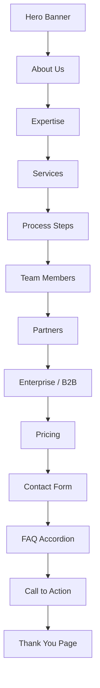

# OnePager WordPress Theme — A Professional One-Page Business Website in Minutes

## What It Does (The Elevator Pitch)

OnePager is a WordPress theme that lets you build a complete, professional one-page business website without writing a single line of code. It comes with 13 ready-made sections — from the hero banner at the top to the contact form at the bottom — and every single piece of text, icon, and image is editable through the standard WordPress visual editor (the "Customizer").

It's the theme that powers [Dedge.no](https://dedge.no) and can be reused for any business, agency, freelancer, or service provider.

## The Problem It Solves

Building a professional business website typically requires one of three painful options:

1. **Hire a web developer** — Expensive (thousands of dollars) and slow (weeks or months).
2. **Use a page builder plugin** — Bloated, slow-loading, and creates "vendor lock-in" (your content is trapped inside the builder's format).
3. **Use a free theme** — Generic, limited, and usually requires coding to customize.

OnePager eliminates all three problems. It provides a complete, professional design out of the box, loads fast (no heavy page builder), and every element is customizable through WordPress's built-in tools. If you can use WordPress, you can use OnePager.

## How It Works

**Step-by-step walkthrough:**

1. **Install the theme** — Upload the theme file in WordPress (Appearance > Themes > Add New > Upload). One click to activate.

2. **Automatic setup** — On first activation, the theme automatically creates a front page, a navigation menu, and sample content. Your site is already functional.

3. **Customize everything** — Open the WordPress Customizer (Appearance > Customize > OnePager Content). Every heading, paragraph, button label, badge, and icon has its own field. Change text, pick from 150+ icons, upload images — all with live preview.

4. **Manage dynamic content** — Services, team members, and FAQ entries are managed through dedicated admin menus (like adding a blog post). Add, edit, or remove them anytime.

5. **Publish** — Click "Publish" and your site is live. No deployment step, no build process.

**The 13 sections:**

## Key Features

| Feature | What It Means for You |
|---|---|
| **13 built-in sections** | Hero, About, Expertise, Services, Process, Team, Partners, Enterprise, Pricing, Contact, FAQ, Call-to-Action, Thank You |
| **Fully customizable content** | Every text, icon, and image is editable through the WordPress Customizer — no code needed |
| **150+ icon choices** | Drop-down icon selectors with categorized, labeled icons for every icon field |
| **Conditional rendering** | Leave a field empty and that element disappears; the layout automatically reorganizes |
| **Auto-reflowing grids** | When you hide elements, the remaining ones redistribute evenly — no gaps or broken layouts |
| **Custom Post Types** | Services, team members, and FAQ items are managed like blog posts — easy to add, edit, or remove |
| **Contact Form 7 integration** | Built-in support for the popular free contact form plugin, with a styled fallback if you don't use it |
| **Mobile responsive** | Looks great on phones, tablets, and desktops with touch-friendly navigation |
| **Translation ready** | All text uses WordPress translation functions — ready for any language |
| **No page builder required** | Zero dependency on Elementor, Divi, or other bloated builders |
| **Fast loading** | Lightweight code with no unnecessary JavaScript frameworks |
| **CTA navigation item** | The last menu item is automatically styled as a prominent call-to-action button |

## How It Compares to Competitors

Since there is no competitor research file for this product, here is a comparison based on the WordPress theme market:

| Approach | Cost | Customization | Speed | Lock-in Risk |
|---|---|---|---|---|
| **OnePager (Dedge)** | Free (GPL) | Full — every element editable | Fast | None — standard WordPress |
| Elementor + theme | Free / $59-$399/yr | Visual builder | Slow (heavy) | High — content in builder format |
| Divi by Elegant Themes | $89/yr | Visual builder | Slow (heavy) | High — proprietary format |
| Astra + page builder | Free / $49-$249/yr | Depends on builder | Medium | Medium |
| Custom development | $3,000–$20,000+ | Unlimited | Slow (weeks) | Low |
| Squarespace/Wix | $16–$49/mo | Template-based | Fast | High — platform lock-in |

**Where OnePager wins:**
- **Zero cost, zero lock-in** — GPL licensed, standard WordPress, no subscriptions.
- **Lightweight performance** — No page builder overhead means faster load times.
- **Complete out of the box** — 13 sections, auto-setup, sample content. Other themes give you a blank canvas.
- **Conditional rendering** — Unique feature: empty fields automatically hide their elements and the layout adapts.

## Screenshots

## Revenue Potential

| Revenue Model | Details |
|---|---|
| **Client website delivery** | Build client websites in hours instead of days — use OnePager as the foundation |
| **Theme licensing** | Sell on WordPress theme marketplaces (ThemeForest, WordPress.org) with premium support tiers |
| **White-label service** | Rebrand and resell as a website-in-a-box for specific industries (clinics, consultancies, agencies) |
| **Maintenance contracts** | Offer ongoing WordPress hosting + updates + content changes as a monthly service |
| **Upsell to custom work** | Start with OnePager, then charge for custom sections, integrations, or multilingual setups |

**Time savings estimate:** A comparable custom one-page website takes 40–80 hours to build. OnePager delivers the same result in 2–4 hours of content entry.

## What Makes This Special

1. **It's a complete business website, not just a theme.** Most themes give you a design and leave you to figure out the content structure. OnePager gives you 13 sections with sensible defaults, auto-setup, and sample content. Install → customize text → publish. Done.

2. **Conditional rendering is a game-changer.** Don't need a Team section? Leave it empty — it disappears. Have only 2 services instead of 6? The grid automatically reflows. No broken layouts, no empty gaps. This is surprisingly rare in WordPress themes.

3. **Real-world proven.** This theme powers [Dedge.no](https://dedge.no) — it's not a demo or a prototype. It's running in production, serving real visitors, on a real business.

4. **No vendor lock-in.** Your content is stored in standard WordPress fields. If you ever switch themes, your posts, pages, services, and team members are still there. No proprietary format to escape from.
