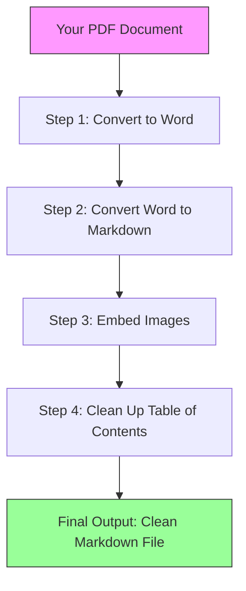

# Pdf2Markdown — Turn Any PDF Into a Clean, Readable Text Document

## What It Does (The Elevator Pitch)

Pdf2Markdown takes PDF files — the kind everyone has but nobody can easily edit — and converts them into Markdown. Markdown is a simple, lightweight text format that looks great in any text editor or documentation tool. Think of it like a high-quality scanner that not only reads the text but also keeps the structure (headings, tables, bullet points), embeds the images, and cleans up the table of contents — all in one step.

You give it a PDF. You get back a perfectly formatted, editable text document.

## The Problem It Solves

PDFs are everywhere in business: contracts, reports, technical manuals, regulatory documents. But PDFs are **locked** — you can't easily search them, reuse their content, feed them into AI tools, or merge them into a knowledge base.

Companies today need their documents to be **searchable, editable, and AI-ready**. Converting PDFs manually is tedious and error-prone. Existing tools often strip out images, break the table of contents, or lose the document structure entirely.

Pdf2Markdown solves this by producing clean, structured output with embedded images — ready for AI indexing, knowledge management systems, or simple human reading.

## How It Works

**Step-by-step walkthrough:**

1. **You provide a PDF** — a single file or an entire folder of PDFs.
2. **PDF to Word** — The tool converts the PDF into a temporary Word document (this preserves the most structure possible).
3. **Word to Markdown** — The Word document is then converted to Markdown using Pandoc, a widely trusted document converter.
4. **Image embedding** — All images from the PDF are extracted and embedded directly in the Markdown file as inline data (no separate image files to manage).
5. **Table of Contents cleanup** — If the PDF had a messy table of contents (as most do after conversion), the tool rebuilds it into a clean, readable list.
6. **You get your Markdown file** — Open it in any editor (VS Code, Cursor, Obsidian, etc.) and it looks great.

The entire process runs with a single command. No manual steps.

## Key Features

| Feature | What It Means for You |
|---|---|
| **Single-file or batch processing** | Convert one PDF or an entire folder at once |
| **Recursive folder scanning** | Processes PDFs in subfolders too — great for large document libraries |
| **Embedded images** | Images stay inside the Markdown file — no broken links, no missing pictures |
| **Table of contents cleanup** | Messy TOC entries from PDF conversion are rebuilt into clean, formatted lists |
| **Structure preservation** | Headings, paragraphs, lists, and tables survive the conversion |
| **Auto-open in editor** | The converted file can open automatically in your preferred editor |
| **Mirror folder structure** | When converting folders, the output mirrors the original folder layout |
| **No cloud dependency** | Everything runs on your own machine — your documents never leave your computer |

## How It Compares to Competitors

| Tool | Price | Needs Internet / AI? | Embedded Images | TOC Cleanup | .NET / Python |
|---|---|---|---|---|---|
| **Pdf2Markdown (Dedge)** | Included | No | Yes | Yes | Python |
| Marker | Free | Optional AI | No | No | Python |
| Docling (IBM) | Free / $4/mo hosted | Yes (AI pipeline) | Yes | No | Python |
| MinerU (OpenDataLab) | Free | No | No | No | Python |
| MarkPDFDown | Free + AI costs | Yes (requires LLM API) | No | No | Python |
| PyMuPDF4LLM | Free | No | Separate files | No | Python |
| pdfmd | Free | No | No | No | Python |

**Where Pdf2Markdown wins:**
- **Image embedding** — Most competitors extract images as separate files or skip them. Pdf2Markdown bakes them directly into the output.
- **Table of contents** — No other tool automatically cleans up messy TOC entries.
- **Zero AI dependency** — Works entirely offline with no API keys, no subscription, no per-page charges.
- **Simplicity** — One command, one output file. No pipeline assembly required.

## Screenshots

## Revenue Potential

| Revenue Model | Details |
|---|---|
| **Internal efficiency tool** | Saves hours of manual PDF-to-text conversion work across the organization |
| **Part of AI/RAG pipeline offering** | Essential preprocessing step when building AI-powered knowledge bases for clients |
| **Consulting add-on** | Include PDF conversion as part of document modernization or digital transformation projects |
| **Bundled with Dedge document tools** | Strengthens the overall Dedge tooling portfolio for enterprise documentation services |

**Time savings estimate:** Converting a 50-page PDF with images manually takes 2–4 hours. Pdf2Markdown does it in under 30 seconds.

## What Makes This Special

1. **Images stay in the document.** This sounds simple, but it's the single biggest frustration with every other converter. When you open a Pdf2Markdown output file, the images are right there — no broken links, no missing folders.

2. **It respects structure.** The tool understands that a PDF has headings, sections, and a table of contents. It preserves that hierarchy rather than dumping everything into flat text.

3. **No subscriptions, no cloud, no AI bills.** In a world where every tool wants a monthly fee or charges per API call, Pdf2Markdown runs entirely on your machine. Your confidential documents stay confidential.

4. **Batch-ready from day one.** Need to convert 500 PDFs from a regulatory archive? Point it at the folder, walk away, come back to 500 clean Markdown files in the same folder structure.
