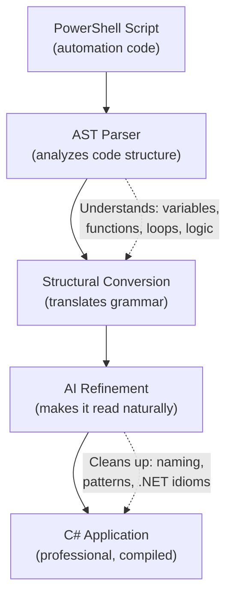

# Pwsh2CSharp — The Automatic Translator from Scripts to Applications

## What It Does (The Elevator Pitch)

Imagine you have a library of books written in French, and you need them all in English. You could hire a translator to rewrite each book by hand — it would take months and cost a fortune. Or you could use an advanced translation tool that does 80–90% of the work automatically, then have a human editor polish the result.

**Pwsh2CSharp** is that translation tool, but for software. It converts PowerShell scripts (small, quick-to-write automation programs used widely in Windows environments) into C# applications (larger, faster, enterprise-grade programs). It combines structural analysis (understanding the grammar and sentence structure) with AI refinement (making the translation read naturally) to produce clean, professional C# code.

## The Problem It Solves

Many organizations have accumulated hundreds or thousands of PowerShell scripts over the years. These scripts handle critical tasks — deploying software, managing servers, processing data. But PowerShell scripts have limitations:
- **Performance** — Scripts run slower than compiled applications
- **Distribution** — Sharing scripts requires everyone to have PowerShell installed and configured
- **Security** — Scripts are plain text; anyone can read and modify them
- **Scalability** — Scripts struggle with complex applications involving user interfaces, web services, or heavy data processing

The obvious solution is to rewrite these scripts as C# applications. The problem? Manual rewriting is extremely expensive. A senior developer costs $100–$200/hour, and converting a complex script can take days or weeks.

Pwsh2CSharp automates 80–90% of this conversion, turning a weeks-long project into a hours-long review.

## How It Works

Here's the step-by-step:

1. **Feed in a PowerShell script** — Point the tool at a script file (or an entire folder of scripts).
2. **AST parsing** — The tool reads the script using AST analysis (Abstract Syntax Tree — think of it as diagramming a sentence to understand its subject, verb, and object). This gives the tool a deep understanding of what the code actually *does*, not just what it looks like.
3. **Structural conversion** — Using the AST analysis, the tool translates each PowerShell construct into its C# equivalent. Variables become typed fields. Functions become methods. PowerShell pipelines become LINQ queries (a C# feature for processing data).
4. **AI refinement** — The raw translation is technically correct but may read awkwardly — like a word-for-word French-to-English translation. The AI pass cleans it up: renaming variables to follow C# conventions, restructuring code to use modern patterns, and adding type safety (ensuring data types are explicit and checked).
5. **Output clean C# code** — The result is a professional C# application that a developer can review, test, and deploy.

## Key Features

- **AST-based parsing** — Deep structural understanding, not naive text replacement. The tool understands what the code *means*, not just what it *says*.
- **AI-powered refinement** — Multiple passes using AI to ensure the output follows C# best practices and reads naturally
- **Batch processing** — Convert entire folders of scripts at once, not just one file at a time
- **Cross-file consistency** — When converting multiple related scripts, the tool maintains consistency (shared variables, naming conventions, etc.)
- **Handles complex patterns** — PowerShell pipelines, error handling, module imports, and advanced features are converted correctly
- **Human-readable output** — The generated C# code is clean enough for a developer to maintain and extend, not just "technically correct but ugly"

## How It Compares to Competitors

| Feature | Pwsh2CSharp | CodePorting AI | CodeConversion (Ironman) | ChatGPT/Claude/Copilot | Manual Rewrite |
|---|---|---|---|---|---|
| **AST parsing** | Yes (deep structural) | No (AI-only) | Yes (basic) | No | N/A (human) |
| **AI refinement** | Yes (multi-pass) | Yes (single-pass) | No | Yes (interactive) | N/A |
| **Batch processing** | Yes (folders) | Yes (with limits) | One file at a time | One file at a time | One file at a time |
| **Cross-file consistency** | Yes | No | No | No | Depends on developer |
| **Complex pattern handling** | Strong | Moderate | Basic | Inconsistent | Depends on developer |
| **Cost per script** | License fee | $10–$25/mo subscription | Free | $20–$200/mo subscription | $1,000–$5,000+ |
| **Speed** | Minutes | Minutes | Minutes | Minutes (with manual iteration) | Days–weeks |

**Key takeaway:** CodePorting AI relies on AI alone (no structural analysis), which misses subtle patterns. Ironman's CodeConversion does basic structural conversion but lacks AI refinement. General AI tools (ChatGPT) can't maintain consistency across large codebases. Pwsh2CSharp is the only tool that combines deep structural analysis with AI polishing for reliable, large-scale conversion.

## Screenshots

## Revenue Potential

### Licensing Model
- **Per-conversion project license** — pay per migration engagement
- **Annual subscription** — for organizations with ongoing conversion needs
- **Managed migration service** — Dedge runs the conversion and delivers the result

### Target Market
- **Enterprise IT departments** with large PowerShell script libraries (100–10,000+ scripts)
- **Managed service providers (MSPs)** converting client automation into distributable applications
- **Companies modernizing legacy infrastructure** — migrating from scripts to microservices or web APIs
- **Software vendors** converting internal tools into commercial products

### Revenue Drivers
- Manual conversion costs $1,000–$5,000+ per complex script. An organization with 500 scripts faces a $500K–$2.5M migration bill. Pwsh2CSharp reduces this by 80–90%
- The PowerShell-to-C# migration is a growing trend as organizations move toward containerized, cloud-native architectures
- There are very few tools specifically targeting this conversion path — the market is underserved

### Estimated Pricing
- **Starter** (up to 50 scripts): $5,000 one-time
- **Professional** (up to 500 scripts): $15,000 one-time
- **Enterprise subscription** (unlimited): $10,000/year
- **Managed migration service**: $25,000–$100,000 per engagement

## What Makes This Special

1. **The AST + AI combination** — No other tool combines deep structural parsing with AI refinement. It's like having both a grammar textbook and a native speaker review your translation — you get structural correctness *and* natural readability.
2. **Batch processing with consistency** — Converting 500 scripts isn't 500 separate jobs. Pwsh2CSharp maintains shared context, ensuring all converted files work together as a coherent codebase.
3. **Purpose-built for this exact conversion** — General AI tools are jacks-of-all-trades. Pwsh2CSharp is laser-focused on PowerShell-to-C#, with deep knowledge of both languages' idioms and patterns.
4. **80–90% automation** — The goal isn't to eliminate developers; it's to eliminate the tedious, mechanical part of conversion. Developers spend their time reviewing and enhancing, not typing boilerplate.
5. **Addresses a real migration wave** — As organizations modernize Windows infrastructure, PowerShell-to-C# conversion is one of the most common (and most painful) tasks. Pwsh2CSharp rides this wave.
