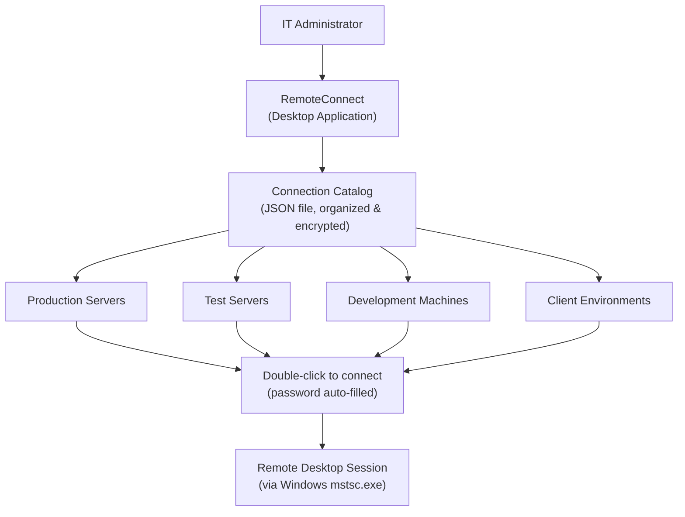

# RemoteConnect (DedgeRemoteConnect) — Your Address Book for Remote Computers

## What It Does (The Elevator Pitch)

Imagine you manage 50 servers across your company. To connect to each one, you need to remember its name, IP address, and login credentials. You open Remote Desktop, type the server name, enter your username and password, adjust the display settings, and wait. Repeat 50 times a day.

**RemoteConnect** is like a phone contacts app, but for remote computers. It stores all your server connections in one organized catalog — with names, addresses, encrypted passwords, and your preferred settings. Double-click a connection, and you're in. No typing, no remembering, no fumbling with passwords.

## The Problem It Solves

IT administrators, DevOps engineers, and support teams connect to remote computers dozens of times a day. Without a connection manager:
- **Passwords are written on sticky notes** — or stored in unencrypted text files, creating security vulnerabilities
- **Connection details are scattered** — some in bookmarks, some in emails, some in someone's memory
- **Setup is repeated every time** — display resolution, drive mapping, audio settings — configured from scratch on each connection
- **Organizing servers is manual** — no easy way to group servers by environment (production, testing, development), location, or project

When the "server guy" goes on vacation, nobody else knows the credentials or connection details.

RemoteConnect solves this by centralizing all connection information in one secure, organized, shareable catalog.

## How It Works

Here's the step-by-step:

1. **Add your connections** — Enter the server name (or IP address), username, password, and any notes. Organize connections into groups (folders) like "Production Servers," "Testing," or "Client A."
2. **Passwords are encrypted** — All credentials are stored using DPAPI encryption (Data Protection API — a Windows security feature that encrypts data so only your Windows user account can decrypt it). No plaintext passwords anywhere.
3. **Connection catalog is a JSON file** — The catalog is stored as a JSON file (a structured text file) that's easy to back up, version-control, or share (passwords remain encrypted and only work on the originating machine).
4. **Connect with one click** — Double-click a connection, and RemoteConnect launches Windows Remote Desktop (mstsc.exe) with all your settings pre-filled. Server name, credentials, display settings — all handled automatically.
5. **Organize and search** — Group connections by environment, project, or location. Search for a server by name when your catalog grows large.

## Key Features

- **Centralized connection catalog** — All remote desktop connections stored in one organized location
- **DPAPI-encrypted credentials** — Passwords are encrypted using Windows security; only your user account can read them
- **JSON-based storage** — The catalog file is easy to back up, move, and version-control
- **One-click connections** — Double-click to connect with credentials auto-filled
- **Organized groups** — Categorize connections by environment, project, client, or any grouping that makes sense
- **Native Windows integration** — Uses the built-in Windows Remote Desktop client (mstsc.exe) for reliable, familiar connections
- **Lightweight** — Small, fast desktop application with minimal resource usage
- **Searchable catalog** — Find any connection quickly as your collection grows

## How It Compares to Competitors

| Feature | RemoteConnect | Royal TS | mRemoteNG | Remote Desktop Manager | RDP Connection Manager | Microsoft RDCMan |
|---|---|---|---|---|---|---|
| **Credential encryption** | DPAPI (Windows native) | Yes (various) | AES + master password | Vault-based | DPAPI | Basic |
| **Storage format** | JSON (Git-friendly) | Proprietary | XML | Proprietary database | Custom | Proprietary |
| **Multi-protocol** | RDP focused | RDP, SSH, VNC, FTP, + more | RDP, SSH, VNC, Telnet | 200+ integrations | RDP, SSH | RDP only |
| **Connection limit (free)** | Unlimited | 10 | Unlimited | Unlimited (personal) | Unlimited | Unlimited |
| **Actively maintained** | Yes (2026) | Yes | Yes | Yes | Yes | No (discontinued) |
| **Complexity** | Simple | High | Moderate | Very high | Moderate | Simple |
| **Pricing** | License fee | Free (Lite)–$1,699 | Free | Free–$249.99/yr | Free | Free (discontinued) |

**Key takeaway:** Royal TS and Remote Desktop Manager are powerful but complex and expensive. mRemoteNG is free but uses complex XML storage. Microsoft RDCMan is discontinued. RemoteConnect occupies the "simple and effective" niche — it does one thing well (RDP connection management) with modern JSON storage, proper encryption, and zero complexity.

## Screenshots

## Revenue Potential

### Licensing Model
- **Individual license** — free or low-cost for personal use
- **Team license** — paid, includes shared catalog features
- **Enterprise license** — centralized catalog management, audit logging

### Target Market
- **IT administrators** — professionals managing Windows Server fleets (the primary audience)
- **Managed service providers (MSPs)** — companies managing infrastructure for multiple clients
- **DevOps engineers** — developers who regularly connect to build, test, and production servers
- **Help desk teams** — support staff who connect to user machines for troubleshooting

### Revenue Drivers
- Microsoft discontinued RDCMan, leaving a vacuum in the "simple RDP manager" category
- mRemoteNG is the main free alternative but is often criticized for complexity and XML corruption issues
- Royal TS starts at EUR49 and goes up to EUR1,699 — significant pricing gap between free and premium tools
- JSON-based catalog is a differentiator for teams that version-control their infrastructure configuration

### Estimated Pricing
- **Individual**: Free or $9.99 one-time
- **Professional** (shared catalogs): $29.99/year
- **Team** (10 seats, centralized management): $199/year
- **Enterprise** (unlimited, audit logging): $999/year

### Market Size Indicator
- mRemoteNG has been downloaded millions of times
- Royal TS has a significant commercial user base at EUR49–EUR1,699 per license
- Every organization with Windows Servers needs remote desktop management — the market is massive and recurring

## What Makes This Special

1. **Simplicity is the product** — While competitors race to add SSH, VNC, FTP, Telnet, and 200 other protocols, RemoteConnect focuses on doing RDP exceptionally well. For the majority of Windows administrators, RDP is 95% of their remote connection needs.
2. **JSON storage is Git-friendly** — Unlike XML (mRemoteNG) or proprietary databases (Royal TS, Remote Desktop Manager), JSON is human-readable, easy to merge, and works perfectly with Git version control. Infrastructure teams can track connection catalog changes alongside their code.
3. **DPAPI encryption is the right choice** — Rather than implementing custom encryption with master passwords (that people forget), RemoteConnect uses Windows' built-in DPAPI. If you can log into your Windows account, you can access your credentials. No extra passwords to manage.
4. **Fills the RDCMan vacuum** — Microsoft's RDCMan was the go-to simple RDP manager for over a decade. It's now discontinued with no replacement. RemoteConnect is the natural successor for teams that want simplicity without the overhead of enterprise tools.
5. **Zero configuration** — No server backend, no database, no complex setup. Install it, add your connections, and start working. The JSON catalog file is the entire product state — back it up by copying one file.
