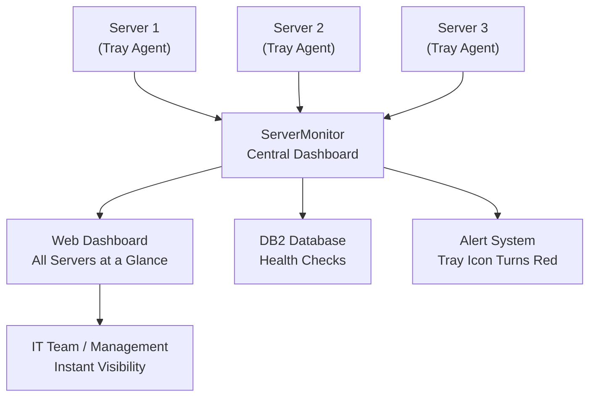

# ServerMonitor — The Health Dashboard for Your Company's Servers

## What It Does (The Elevator Pitch)

ServerMonitor gives you a single screen showing the health of every server in your organization — which ones are online, which are struggling, and which need attention — complete with a system tray icon that turns red the moment something goes wrong. Think of it as the vital signs monitor in a hospital, but for your company's computers.

## The Problem It Solves

Companies depend on servers the way cities depend on power plants — when one goes down, whole departments grind to a halt. But most organizations don't have a simple way to see the health of their entire server fleet at a glance. The IT team finds out about problems when angry users start calling, or worse, when a critical batch job fails at 2 AM and nobody notices until the next morning.

Even organizations that have monitoring tools often struggle with complexity. Enterprise monitoring platforms can take months to configure, cost tens of thousands per year, and require dedicated staff to maintain. Meanwhile, the actual question is simple: "Are all our servers healthy right now? If not, which ones need attention?"

**The real-world analogy:** Think of your car's dashboard. You don't need to be a mechanic to understand it — a green light means everything's fine, a yellow light means pay attention, a red light means pull over now. ServerMonitor is that same simple, glanceable dashboard for your entire server infrastructure, including the DB2 databases that run your core business applications.

## How It Works

ServerMonitor uses a simple two-part architecture. On each server you want to monitor, a tiny **Tray Agent** runs quietly in the background — it's visible as a small icon in the system tray (the row of small icons near the clock on Windows). This agent continuously checks the server's vital signs: CPU usage (how hard the processor is working), memory usage (how much working space is available), disk space (how full the hard drives are), and network connectivity (is the server reachable?).

Each Tray Agent sends its health data to the **Central Dashboard**, a web-based control center that displays all servers on one screen. The dashboard uses color coding: green means healthy, yellow means a metric is approaching a warning threshold, red means something needs immediate attention. You can see the entire fleet at a glance or drill down into any individual server for detailed metrics.

For organizations running IBM DB2 databases, ServerMonitor goes further. It actively checks the health of each database — is it running? Is it responsive? Are there any error conditions? Database health is treated as a first-class metric alongside traditional server metrics, because for many enterprises, the database *is* the business.

When something goes wrong, the Tray Agent icon on the affected server turns red, and the central dashboard highlights the problem. IT staff can see what's wrong before users even notice.

## Key Features

- **Web dashboard** — see all servers on one screen, accessible from any browser, no special software needed
- **System tray agent** — lightweight agent on each server shows local health status and turns red on problems
- **DB2 database monitoring** — built-in awareness of IBM DB2 database health, not just generic server metrics
- **Color-coded status** — green/yellow/red indicators make it instantly obvious which servers need attention
- **Real-time updates** — health data refreshes continuously, not on 5-minute polling intervals
- **Zero-dependency deployment** — the tray agent is a single small application, no complex installation or prerequisites
- **Historical data** — track trends over time to spot servers that are gradually degrading before they fail
- **Designed for Windows Server** — purpose-built for Windows Server environments, not a Linux tool awkwardly ported

## How It Compares to Competitors

| Feature | **Dedge ServerMonitor** | Datadog | Zabbix | PRTG | Nagios XI | Checkmk | Prometheus + Grafana |
|---|---|---|---|---|---|---|---|
| **Setup complexity** | Minutes | Hours | Days | Hours | Days | Hours | Days |
| **Native DB2 monitoring** | Built-in | Generic plugin | Manual config | Sensor-based | Plugin needed | Manual config | Custom exporter |
| **System tray agent** | Yes | No | No | No | No | No | No |
| **Windows Server focus** | Native | Cross-platform | Linux-centric | Cross-platform | Linux-centric | Cross-platform | Linux-centric |
| **Self-hosted** | Yes | Cloud SaaS | Yes | Yes | Yes | Yes | Yes |
| **Pricing** | One-time license | $15/host/month | Free | $179–$1,492/month | $2,495 one-time | Free–€600+/year | Free |
| **Learning curve** | Low | Medium | High | Medium | High | Medium | High |

**Dedge's advantage:** ServerMonitor is built for a specific, common scenario: Windows Server environments running DB2 databases, managed by IT teams that need simplicity, not complexity. Where Datadog charges per host per month (costs spiral as you add servers), Zabbix requires a dedicated administrator, and Prometheus demands a Kubernetes mindset, ServerMonitor installs in minutes, shows results immediately, and treats DB2 as a first-class citizen — not an afterthought requiring custom plugins. The system tray agent is a unique feature that no major competitor offers: local, visual, instant feedback on each server.

## Screenshots

## Revenue Potential

**Target Market:** Small-to-mid enterprises (50–500 servers) running Windows Server with DB2, particularly those who find enterprise monitoring tools too complex and expensive. Also consultancies and MSPs (Managed Service Providers) who manage multiple client environments.

**Pricing Model Ideas:**

| Tier | Price | Includes |
|---|---|---|
| **Small Business** | $2,000 one-time + $400/year | Up to 10 servers, web dashboard, tray agents |
| **Professional** | $6,000 one-time + $1,200/year | Up to 50 servers, DB2 monitoring, historical data |
| **Enterprise** | $15,000 one-time + $3,000/year | Unlimited servers, custom alert rules, API access, priority support |
| **MSP/Reseller** | Custom pricing | Multi-tenant dashboard, white-labeling option |

**Revenue Projection:** The infrastructure monitoring market exceeds $6 billion annually. ServerMonitor targets the underserved "too small for Datadog, too busy for Zabbix" segment. With 200 customers at the Professional tier, annual recurring revenue reaches $240K with $1.2M in license revenue — and the MSP channel could multiply that significantly.

## What Makes This Special

1. **DB2 as a first-class citizen.** While every other monitoring tool treats databases as "just another thing to monitor," ServerMonitor understands that for DB2-dependent enterprises, the database health *is* the business health. Built-in DB2 checks mean no custom plugins, no scripting, no guesswork.

2. **The tray agent changes the game.** When a server administrator is logged into a machine and the tray icon turns red, they know *immediately* — before any dashboard, before any email alert, before any phone call. It's the fastest possible feedback loop.

3. **Simplicity is the feature.** In a market drowning in complex, feature-bloated monitoring platforms, ServerMonitor's deliberate simplicity is its strongest selling point. It answers the one question that matters: "Is everything healthy right now?"

4. **Windows-native, not an afterthought.** Most monitoring tools are built for Linux and grudgingly support Windows. ServerMonitor is built *for* Windows Server from the ground up — it understands Windows services, Windows events, Windows performance counters, and Windows system trays natively.
