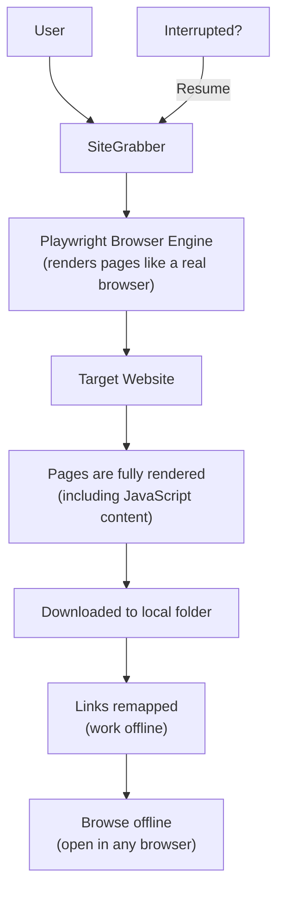

# SiteGrabber — Download Any Website for Offline Viewing

## What It Does (The Elevator Pitch)

Imagine you're about to board a 12-hour flight. You need to study a competitor's website, review training materials on an internal portal, or archive a client's site before a redesign. But there's no Wi-Fi.

**SiteGrabber** downloads an entire website — every page, every image, every file — and saves it to your computer so you can browse it offline exactly as if you were online. Unlike simple download tools, SiteGrabber uses a real web browser behind the scenes, which means it can capture modern websites that rely on JavaScript to display content (most websites built in the last 5 years). And if the download gets interrupted — power outage, network drop, laptop closes — it picks up right where it left off.

## The Problem It Solves

Modern websites aren't simple HTML files anymore. They're complex applications that build their pages dynamically using JavaScript (a programming language that runs in the browser). This means:
- **Traditional download tools fail** — Tools like wget or HTTrack download the raw files but miss content that's generated by JavaScript. You get an empty shell instead of the real website.
- **Screenshots aren't enough** — A screenshot captures one moment, not navigation, links, or interactive content
- **Browser "Save Page" is limited** — Your browser's "Save As" function saves one page at a time and often breaks the layout
- **No resume capability** — Most tools start from scratch if the download is interrupted. For large sites (thousands of pages), this is a dealbreaker.

SiteGrabber solves all of these problems by using Playwright (a real browser engine that renders pages exactly as a user would see them) and supporting resumable downloads.

## How It Works

Here's the step-by-step:

1. **Enter a website URL** — Tell SiteGrabber which site you want to download.
2. **SiteGrabber launches a browser engine** — Using Playwright (a headless browser — a real browser that runs invisibly, without a visible window), it visits each page on the site.
3. **Pages are fully rendered** — Unlike traditional tools that just download files, SiteGrabber renders each page as a real browser would. JavaScript-generated content, dynamic menus, lazy-loaded images — all captured.
4. **Everything is saved locally** — Pages, images, stylesheets, scripts — the entire site structure is preserved on your hard drive.
5. **Links are remapped** — Internal links are rewritten to point to local files instead of the internet. Click a navigation link, and it opens the local copy — just like browsing the real site.
6. **Resume if interrupted** — Close your laptop? Network goes down? SiteGrabber remembers which pages it already downloaded and picks up right where it left off.
7. **Browse offline** — Open the saved `index.html` in any web browser and navigate the site as if you were online.

## Key Features

- **Full browser rendering** — Uses Playwright to render JavaScript-heavy websites that traditional downloaders miss
- **Resumable downloads** — Interrupted downloads continue from where they stopped, not from the beginning
- **Link remapping** — All internal links work offline — navigate the saved site naturally
- **Complete site capture** — Pages, images, CSS, fonts, and other assets are preserved
- **Handles modern frameworks** — React, Angular, Vue, Next.js, and other JavaScript frameworks that build pages dynamically
- **No page limits** — Download sites with thousands of pages (subject to disk space)
- **Simple operation** — Point it at a URL and let it run

## How It Compares to Competitors

| Feature | SiteGrabber | HTTrack | Cyotek WebCopy | websitedownloader.org | wget | SiteSucker |
|---|---|---|---|---|---|---|
| **JavaScript rendering** | Yes (Playwright) | No | No | Yes (Chrome) | No | No |
| **Resume support** | Yes | Yes | Partial | No | Yes | Yes |
| **Modern frameworks** | React, Vue, Angular | No | No | Yes | No | No |
| **Platform** | Windows | Windows/Linux/Mac | Windows only | Web (cloud) | All platforms | macOS only |
| **Page limit** | Unlimited | Unlimited | Unlimited | 10 free, then paid | Unlimited | Unlimited |
| **Last updated** | Active (2026) | 2017 (abandoned) | 2023 | Active | Active | Active |
| **Pricing** | License fee | Free | Free | Free (10 pages) / Paid | Free | $4.99 |

**Key takeaway:** HTTrack is the classic tool but hasn't been updated since 2017 and can't render JavaScript. Cyotek WebCopy explicitly lacks JavaScript support. websitedownloader.org is cloud-based with page limits. SiteSucker is macOS only. SiteGrabber is the only Windows-native tool with full JavaScript rendering via Playwright and robust resume capability.

## Screenshots

## Revenue Potential

### Licensing Model
- **Individual license** — one-time purchase or annual subscription
- **Team license** — multiple seats for agencies and enterprise teams
- **Enterprise** — unlimited seats with priority support

### Target Market
- **Digital marketing agencies** — archiving client websites before redesigns, competitive analysis, compliance documentation
- **Legal and compliance teams** — capturing website content as evidence or for regulatory archives
- **Training departments** — downloading training portals for offline use during workshops or remote sessions
- **Competitive intelligence** — archiving competitor websites for analysis
- **Government and military** — offline access in air-gapped (no internet) environments
- **Travelers and remote workers** — accessing reference materials without internet

### Revenue Drivers
- Website archiving is a growing compliance requirement (especially in finance, healthcare, and government)
- The market leader (HTTrack) has been abandoned since 2017, leaving a vacuum for a modern replacement
- JavaScript rendering capability is a genuine barrier that most free tools cannot cross
- Agencies and enterprises will pay for reliability (resume support) and completeness (JavaScript rendering)

### Estimated Pricing
- **Individual**: $29 one-time or $19/year
- **Professional** (5 seats): $99/year
- **Enterprise** (unlimited): $499/year

## What Makes This Special

1. **Playwright-powered rendering** — Most website downloaders were built before JavaScript-heavy websites became the norm. SiteGrabber uses a real browser engine, capturing content that competitors simply cannot see.
2. **Resume is not optional** — Large site downloads take hours. Any interruption (network, power, user action) with traditional tools means starting over. SiteGrabber's resume capability makes large downloads practical rather than risky.
3. **Fills the HTTrack vacuum** — HTTrack was the go-to tool for two decades, but it's been abandoned since 2017. Millions of users need a modern replacement that handles today's JavaScript-first web.
4. **Simple but powerful** — No complex configuration, no scripting required. Enter a URL, press start, browse offline. The complexity (Playwright, link remapping, state tracking for resume) is hidden behind a simple interface.
5. **Addresses compliance needs** — Regulatory requirements increasingly demand website archiving. SiteGrabber produces a complete, browseable archive that satisfies documentation and evidence-preservation requirements.
