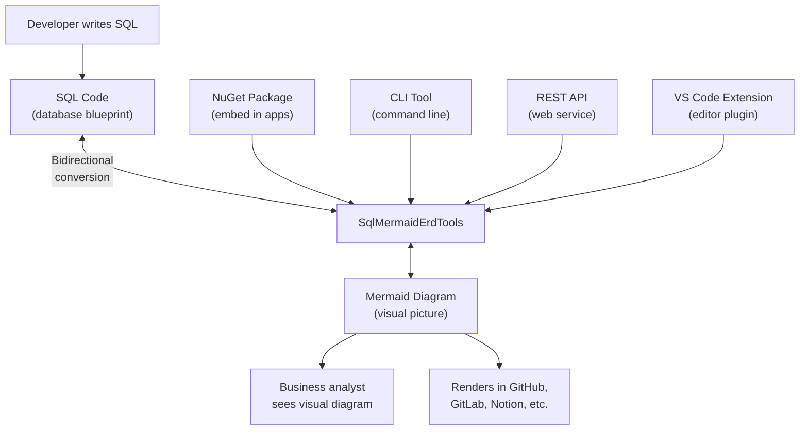

# SqlMermaidErdTools — See Your Database, Understand Your Database

## What It Does (The Elevator Pitch)

Imagine you're renovating a house, but instead of blueprints, someone hands you a 10,000-line text file describing every wall, door, and window in technical notation. You'd spend hours trying to visualize the floor plan.

**SqlMermaidErdTools** takes that text file (SQL — the language used to describe database structures) and instantly turns it into a visual diagram that anyone can understand. And it works in reverse too — draw a diagram, and it generates the SQL code. It's a two-way translator between database blueprints and visual diagrams.

It supports 31+ database dialects (variations of SQL), ships as a software library, a command-line tool, a web API, and a Visual Studio Code extension, and is sold through a Stripe-powered online store.

## The Problem It Solves

Databases are the backbone of every application, but understanding their structure is hard:
- **Database architects** write CREATE TABLE statements (the code that defines database structure) that are impossible for non-technical stakeholders to understand
- **New team members** spend days trying to understand how hundreds of tables relate to each other
- **Documentation goes stale** — someone draws a diagram when the database is created, but nobody updates it as tables are added and changed
- **Communication breaks down** — when business analysts, developers, and DBAs look at the same database, they each see something different because there's no shared visual language

SqlMermaidErdTools solves this by making database visualization automatic, always up-to-date, and accessible to everyone.

## How It Works

Here's the step-by-step:

1. **Input SQL or a Mermaid diagram** — Paste your database definition (CREATE TABLE statements) or a Mermaid diagram (a simple text-based diagram format supported by GitHub, GitLab, Notion, and many other tools).
2. **Conversion happens instantly** — SqlMermaidErdTools parses the input, understands the tables, columns, relationships (which tables connect to which), and data types.
3. **Output the other format** — SQL in? Diagram out. Diagram in? SQL out. Bidirectional.
4. **Use it anywhere** — The tool runs as a NuGet package (embed it in your own applications), a CLI tool (run it from the command line in scripts), a REST API (call it from any web application), or a VS Code extension (use it right inside your code editor).
5. **Diagrams render everywhere** — Mermaid diagrams are supported natively by GitHub, GitLab, Notion, Confluence, and dozens of other platforms. Paste the output into your README, and it renders as a beautiful visual diagram automatically.

## Key Features

- **Bidirectional conversion** — SQL to diagram AND diagram to SQL (most competitors only go one way)
- **31+ SQL dialects** — Supports MySQL, PostgreSQL, SQL Server, Oracle, DB2, SQLite, and 25+ more
- **Multiple delivery surfaces** — NuGet package, CLI tool, REST API, and VS Code extension
- **Mermaid output** — Uses the Mermaid standard, which renders natively in GitHub, GitLab, Notion, and many other platforms
- **No database connection required** — Works from SQL text files alone; no need to connect to a live database
- **Stripe-powered store** — Ready-to-sell commercial product with subscription management
- **ERD generation** — Produces Entity Relationship Diagrams (visual maps showing how database tables connect to each other)

## How It Compares to Competitors

| Feature | SqlMermaidErdTools | dbdiagram.io | ChartDB | SchemaCrawler | XDevUtilities | sql2mermaid-cli |
|---|---|---|---|---|---|---|
| **Direction** | Bidirectional | One-way (DBML→diagram) | One-way | One-way (DB→diagram) | One-way | One-way |
| **SQL dialects** | 31+ | Limited (via DBML) | 5 | JDBC databases | 4 | SQL only |
| **NuGet package** | Yes | No | No | No (Java) | No | No (Python) |
| **CLI tool** | Yes | No | No | Yes | No | Yes |
| **REST API** | Yes | No | No | No | No | No |
| **VS Code extension** | Yes | No | No | No | No | No |
| **Requires database connection** | No (parses text) | No | No | Yes (JDBC) | No | No |
| **Output format** | Mermaid (universal) | Proprietary (DBML) | Proprietary | Graphviz/Mermaid | Mermaid | Mermaid |
| **Pricing** | Subscription/license | Free–$75/mo | Free | Free | Free | Free |

**Key takeaway:** dbdiagram.io is the most popular tool but uses a proprietary format (DBML) and is browser-only. ChartDB supports only 5 databases. SchemaCrawler requires a live database connection and Java. SqlMermaidErdTools is the only product offering bidirectional conversion across 31+ dialects, delivered through four different surfaces (NuGet, CLI, API, VS Code), using the open Mermaid standard.

## Screenshots

## Revenue Potential

### Licensing Model
- **NuGet package subscription** — developers embed it in their applications
- **CLI/API subscription** — teams use it in their development workflow
- **VS Code extension** — freemium model (basic free, advanced features paid)
- **Stripe-powered storefront** — already set up for self-service purchases

### Target Market
- **Software development teams** — anyone who builds or maintains databases
- **Database administrators** — professionals who manage database structure and documentation
- **Technical writers** — people who document system architecture
- **DevOps/CI-CD pipelines** — automated documentation generation during deployment

### Revenue Drivers
- Database documentation is a universal need — every organization with a database needs diagrams
- The Mermaid standard is exploding in popularity (supported by GitHub, GitLab, Notion, etc.) — SqlMermaidErdTools rides this adoption wave
- Bidirectional conversion is a unique differentiator that justifies premium pricing
- 31+ dialects means a very broad market — not just PostgreSQL or MySQL shops, but Oracle, DB2, and niche databases too

### Estimated Pricing
- **Individual** (NuGet + CLI): $9/month or $89/year
- **Team** (NuGet + CLI + API, up to 10 developers): $49/month or $479/year
- **Enterprise** (unlimited, all surfaces, priority support): $199/month or $1,899/year
- **VS Code extension**: Free tier + $4.99/month Pro

### Market Size Indicator
- dbdiagram.io (the market leader) has millions of users and charges up to $75/month for team plans
- The database documentation tools market is estimated at $500M+ annually
- Mermaid.js has 75,000+ GitHub stars, indicating massive ecosystem adoption

## What Makes This Special

1. **Bidirectional is the killer feature** — Every competitor goes one way (SQL to diagram or diagram to SQL). SqlMermaidErdTools does both. Design a database visually, generate the SQL. Have existing SQL? See it as a diagram. No one else offers this.
2. **31+ dialects** — Most tools support 3–5 database types. SqlMermaidErdTools supports 31+, meaning it works for virtually any database system in existence.
3. **Four delivery surfaces** — NuGet for embedding, CLI for scripting, API for web integration, VS Code for editing. Customers choose the form factor that fits their workflow.
4. **Open standard output** — Mermaid is supported by GitHub, GitLab, Notion, Confluence, and dozens more. Diagrams generated by SqlMermaidErdTools render automatically on these platforms — no export, no image files, just paste and go.
5. **Already monetized** — The Stripe-powered store is built and running. This isn't a product that needs commercialization work — it's ready to sell today.
