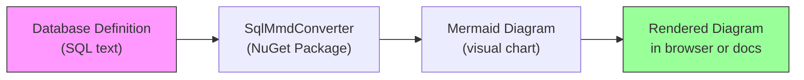

# SqlMmdConverter — The First Step Toward Visual Database Documentation

## What It Does (The Elevator Pitch)

SqlMmdConverter is a code library (a "NuGet package" — think of it as a plug-in that other software can use) that converts database structure definitions into visual diagrams. You give it the text that describes your database tables, and it produces a Mermaid diagram — a simple text format that renders as a beautiful, interactive chart showing tables, their columns, and how they relate to each other.

It's the predecessor to SqlMermaidErdTools — the first version that proved the concept before the full product was built. Think of it as the prototype that validated the idea.

## The Problem It Solves

Every company has databases — structured storage where business data lives (customers, orders, invoices, products). These databases can have hundreds of tables with thousands of relationships between them. Understanding how data flows through these tables is critical for:

- **New team members** trying to understand a system they've just joined
- **Business analysts** mapping data flows for reporting or compliance
- **Architects** planning changes or migrations to new systems
- **Auditors** verifying data integrity and access patterns

The problem? Most database documentation is either **nonexistent**, **outdated**, or **buried in dense technical text**. A visual diagram is worth a thousand words — but creating one manually is tedious, error-prone, and immediately goes stale when the database changes.

SqlMmdConverter automates this: give it the database definition, get back a visual diagram. Every time. Up to date. Instantly.

## How It Works

**Step-by-step walkthrough:**

1. **Start with your database definition** — This is the text (called "SQL DDL") that describes your tables, columns, data types, and relationships. Every database has this.

2. **Pass it to SqlMmdConverter** — The library parses the SQL text, understands the structure, and identifies how tables are connected through foreign keys (links between tables).

3. **Get a Mermaid diagram** — The output is Mermaid markup, a simple text format that tools like GitHub, Confluence, Notion, and many documentation platforms automatically render as interactive visual diagrams.

4. **View the result** — The diagram shows each table as a box, columns inside each box, and lines connecting related tables. At a glance, you can see the entire data model.

**Example — what comes out:**

Imagine you have a Customer table and an Order table. SqlMmdConverter produces a diagram that shows:
- **Customer** box with columns: customer_id, email, first_name, last_name
- **Order** box with columns: order_id, customer_id, order_date, total_amount
- **A line** connecting Customer to Order (because orders belong to customers)

This is generated automatically from the database definition text. No manual drawing required.

## Key Features

| Feature | What It Means for You |
|---|---|
| **31+ database dialects supported** | Works with SQL Server, PostgreSQL, MySQL, Oracle, DB2, SQLite, Snowflake, BigQuery, and more |
| **Automatic relationship detection** | Finds and visualizes foreign key connections between tables |
| **Full schema support** | Tables, columns, primary keys, foreign keys, unique constraints, defaults, data types |
| **NuGet package** | Integrates directly into other software — can be built into automated documentation pipelines |
| **No database connection needed** | Works from the SQL text alone — no need to connect to a live database |
| **Bundled Python runtime** | No external software installation required — everything is self-contained |
| **Async support** | Can run without blocking other operations — important for integration into web applications |

## How It Compares to Competitors

| Tool | Price | Works from SQL Text? | .NET Integration? | Dialects Supported |
|---|---|---|---|---|
| **SqlMmdConverter (Dedge)** | MIT (free) | Yes | Yes (NuGet) | 31+ |
| mermerd | Free | No — needs live database | No (Go binary) | 4 |
| sql2mermaid-cli | Free | Yes | No (Python only) | Limited |
| mermaid-gen | Free | No — needs code models | Partial (.NET CLI) | N/A |
| SchemaCrawler | Free | No — needs live database + Java | No (Java) | JDBC databases |
| XDevUtilities | Free | Yes (browser only) | No | 4 |
| Tusharad SQL to Mermaid | Free | Yes (browser only) | No | 1 (PostgreSQL) |

**Where SqlMmdConverter wins:**
- **Only .NET NuGet package** for SQL-to-Mermaid conversion — integrates directly into software projects and automated pipelines.
- **31+ dialect support** — handles nearly every database vendor. Competitors typically support 1–4.
- **No live database needed** — works from the SQL text definition alone. Most competitors require an active database connection.
- **Self-contained** — ships with its own Python runtime. Nothing extra to install.

## Screenshots

## Revenue Potential

| Revenue Model | Details |
|---|---|
| **NuGet package (open source / freemium)** | Free tier drives adoption; premium features (batch processing, custom formatting) could be monetized |
| **Foundation for SqlMermaidErdTools** | This package proved the concept and led to the more capable successor product |
| **Consulting integration** | Include automated database documentation as part of enterprise consulting engagements |
| **CI/CD pipeline component** | Sell as part of an automated documentation pipeline — "your database diagrams update every time your schema changes" |
| **Enterprise documentation contracts** | Large organizations need database documentation for compliance — automate it with SqlMmdConverter |

**Strategic value:** SqlMmdConverter is the proof-of-concept that validated the market for SqlMermaidErdTools. Its existence on NuGet establishes Dedge's credibility in the database tooling space and serves as a gateway to the more comprehensive product.

## What Makes This Special

1. **It's the origin story.** SqlMmdConverter is where Dedge's database visualization journey began. It proved that automatic SQL-to-diagram conversion was not only possible but valuable — and led directly to the full SqlMermaidErdTools product.

2. **It works without a database.** Most competitors require you to connect to a running database. SqlMmdConverter works from the SQL text alone. This means you can generate diagrams from backup files, migration scripts, or documentation — even if the database no longer exists.

3. **31+ dialects from one tool.** The tool uses SQLGlot, a battle-tested SQL parser, to understand nearly every SQL variant in existence. Whether your client uses SQL Server, PostgreSQL, Oracle, DB2, or even Snowflake — one tool handles them all.

4. **It's a building block, not just a tool.** As a NuGet package, SqlMmdConverter can be embedded into other software. It's not a standalone application you run manually — it's a component you build into automated pipelines. This makes it far more valuable in enterprise settings where documentation needs to stay current automatically.

5. **Published on NuGet.org.** The package is publicly available at [nuget.org/packages/Sql2MermaidErdConverter](https://www.nuget.org/packages/Sql2MermaidErdConverter/), giving Dedge a visible presence in the .NET developer ecosystem with professional branding and metadata.
