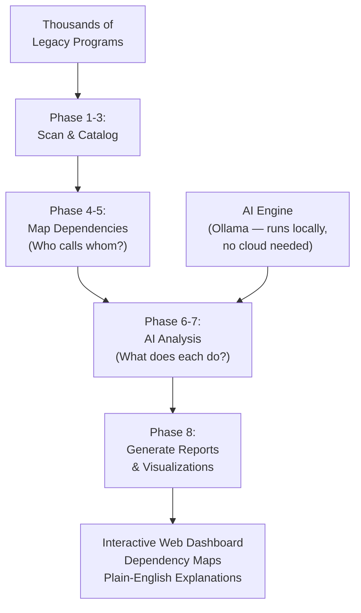

# SystemAnalyzer — The AI-Powered X-Ray Machine for Legacy Code

## What It Does (The Elevator Pitch)

SystemAnalyzer scans thousands of legacy COBOL programs, maps out every relationship between them, and uses artificial intelligence to explain what each one does — in plain English. It's like getting an X-ray of a 40-year-old system that reveals how every piece connects, what each piece does, and where the risks are hiding.

## The Problem It Solves

Large organizations often have thousands of legacy programs — sometimes tens of thousands — that have been running critical operations for decades. The people who wrote them are long gone. The programs call each other in complex webs of dependencies that nobody fully understands. When a business asks "Can we change our billing rules?", the development team's honest answer is often: "We're not sure which programs would be affected."

This isn't just inconvenient — it's dangerous. Changing one program without understanding its ripple effects can crash billing, break compliance reporting, or corrupt customer data. So teams either move painfully slowly (spending weeks researching before making simple changes) or take dangerous risks (making changes and hoping nothing breaks).

**The real-world analogy:** Imagine a hospital that has a complex patient with no medical records and 40 years of undocumented surgeries. Before any new treatment, doctors need a complete scan — X-rays, MRIs, blood work — to understand what's going on inside. SystemAnalyzer is that full-body scan for your legacy systems: it reveals every organ, every connection, every potential risk, so you can make informed decisions about treatment.

## How It Works

SystemAnalyzer works through 8 carefully sequenced phases, like a thorough medical examination:

**Phases 1–3: Scan & Catalog.** The system reads every source code file, inventories every program, and builds a complete catalog — like a census of your entire code population. It identifies programs, their types, their sizes, and their basic characteristics.

**Phases 4–5: Map Dependencies.** This is where the "family tree" is built. SystemAnalyzer traces every connection: which programs call which other programs, which programs read or write to which database tables, which programs share data through common files. The result is a complete dependency map — a visual web showing how everything connects.

**Phases 6–7: AI Analysis.** Using Ollama (an AI engine that runs entirely on your own servers — no internet connection or cloud service needed), SystemAnalyzer reads each program and writes a plain-English explanation of what it does. "This program processes monthly insurance premium calculations, reads the CUSTOMER and POLICY tables, and generates billing statements." Business people can actually understand this.

**Phase 8: Reports & Visualization.** Everything is compiled into an interactive web dashboard with visual dependency maps (powered by GoJS and Mermaid — industry-standard tools for creating interactive diagrams). You can click on any program and instantly see what it does, what it depends on, and what depends on it.

## Key Features

- **8-phase deep analysis** — thorough, methodical examination from cataloging to AI explanation
- **AI-powered plain-English explanations** — every program gets a human-readable description of what it does, no programming knowledge needed to understand
- **Interactive dependency maps** — click on any program to see its connections, zoom in on problem areas, trace impact chains
- **Runs entirely on-premise** — the AI engine (Ollama) runs on your own servers, so sensitive source code never leaves your building
- **Impact analysis** — select any program and instantly see every other program that would be affected if you changed it
- **Scalable to tens of thousands of programs** — designed for enterprise-scale legacy estates, not toy examples
- **Web-based dashboard** — accessible to project managers, business analysts, and executives — not just programmers

## How It Compares to Competitors

| Feature | **Dedge SystemAnalyzer** | CAST Imaging | Micro Focus Enterprise Analyzer | IBM watsonx for Z | CloudFrame Atlas | Raincode Insight |
|---|---|---|---|---|---|---|
| **AI-powered explanations** | Yes (Ollama, local) | No | No | Yes (cloud) | Yes (cloud) | No |
| **Runs entirely on-premise** | Yes | On-premise option | Yes | Cloud only | Cloud-dependent | Yes |
| **Interactive web dashboard** | Yes (GoJS/Mermaid) | Yes | Legacy UI | Limited | Limited | Basic |
| **Structured 8-phase analysis** | Yes | Unstructured | Unstructured | Unstructured | Unstructured | Unstructured |
| **Focus** | Analysis & documentation | Analysis + migration | Analysis | Migration | Migration readiness | Migration strategy |
| **Pricing** | One-time license | $10K–$108K/year | $50K+/year | Six-figure contracts | Enterprise | Enterprise |

**Dedge's advantage:** SystemAnalyzer is one of the few tools that combines AI-powered natural-language explanations with traditional dependency analysis — and the *only* one that does it entirely on-premise with no cloud dependency. Competitors like IBM watsonx and CloudFrame rely on cloud services, which is a dealbreaker for organizations with strict data sovereignty requirements (banks, government, defense). The structured 8-phase approach also means results are reproducible and auditable, unlike competitors' "black box" analyses. And at a fraction of the cost of CAST Imaging or Micro Focus, SystemAnalyzer delivers the analysis that matters most — understanding what you have — without the six-figure price tag.

## Screenshots

## Revenue Potential

**Target Market:** Every organization with a large COBOL/legacy estate planning any form of modernization, migration, or risk management. This is a surprisingly large market — 95% of ATM transactions and 80% of in-person financial transactions still run on COBOL.

**Pricing Model Ideas:**

| Tier | Price | Includes |
|---|---|---|
| **Assessment** | $15,000 one-time | Up to 5,000 programs, all 8 phases, PDF report |
| **Professional** | $30,000 one-time + $6,000/year | Up to 25,000 programs, web dashboard, ongoing re-analysis |
| **Enterprise** | $60,000 one-time + $12,000/year | Unlimited programs, custom AI prompts, integration with AutoDocJson, priority support |

**Revenue Projection:** The legacy modernization market ($16B in 2025, growing 16% annually) practically *requires* analysis as step one. Every consulting firm selling modernization services needs a tool like this. With potential for both direct sales and OEM licensing (selling to other software companies to embed in their offerings), a realistic 3-year target is $2M–$5M annually.

## What Makes This Special

1. **AI that speaks business, not code.** The plain-English explanations mean that project managers, executives, and business analysts can finally understand what's in the legacy estate — without depending on a scarce COBOL programmer to translate.

2. **On-premise AI is non-negotiable for many customers.** Banks and government agencies cannot send source code to cloud AI services. SystemAnalyzer's use of Ollama (a locally-hosted AI) means full AI power with zero data exposure.

3. **The 8-phase structure builds confidence.** Instead of a mysterious "scan and report" approach, SystemAnalyzer's explicit 8-phase methodology lets customers see progress, validate intermediate results, and trust the final output. This is critical in risk-averse industries.

4. **Part of the Dedge ecosystem.** SystemAnalyzer's output feeds directly into AutoDocJson (for documentation) and AiDoc.WebNew (for AI search), creating a complete modernization toolkit. Competitors sell isolated tools; Dedge sells a connected platform.
