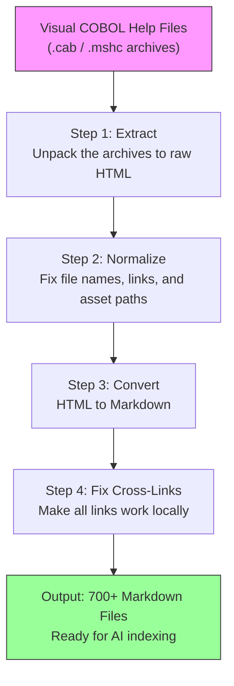

# VcHelpExport — Digitize Legacy Software Documentation for AI-Powered Search

## What It Does (The Elevator Pitch)

VcHelpExport takes the built-in help documentation from Visual COBOL — an old but still widely used programming language tool — and converts it into modern, searchable Markdown files. Think of it as digitizing an old encyclopedia so that a modern AI search engine can find answers inside it.

The result: hundreds of help topics, previously locked inside proprietary help viewer formats, become individual text files that any AI tool, search engine, or knowledge base can index and query.

## The Problem It Solves

Many enterprises still run critical business systems written in COBOL. The developers maintaining these systems need reference documentation — but that documentation is trapped inside **Microsoft Help Viewer** format (`.cab` and `.mshc` files). These formats:

- Cannot be searched by modern tools or AI assistants
- Cannot be indexed by knowledge management systems
- Require specific, outdated viewer software to read
- Cannot be shared as simple files via email, chat, or wikis

When a developer needs to look something up, they have to open a clunky help viewer, navigate through a table of contents, and hope they find the right page. There is no way to ask an AI assistant "How do I use the RunUnit class?" and get an answer from this documentation.

VcHelpExport bridges the gap between legacy documentation and modern AI-powered workflows.

## How It Works

**Step-by-step walkthrough:**

1. **Extract** — The tool unpacks compressed `.cab` files (and nested `.mshc` archives inside them) into raw HTML files. These are the original help topic pages.

2. **Normalize** — Each HTML file is renamed from a cryptic ID to its actual page title (e.g., `RunUnit Class.html` instead of `2f8a3b.html`). Internal links that used proprietary `ms-xhelp://` addresses are rewritten to point to the new filenames.

3. **Convert to Markdown** — The cleaned-up HTML is converted to Markdown using a specialized converter that preserves code examples, tables, and formatting.

4. **Fix cross-links** — All links between Markdown files are updated so they work as local file links. If you click a link in one topic, it opens the related topic right in your editor.

The entire process runs with a single command and produces 700+ individual Markdown files — one per help topic.

## Key Features

| Feature | What It Means for You |
|---|---|
| **Full pipeline in one script** | Extract, normalize, convert, and link-fix in a single run |
| **700+ topics converted** | Every help page becomes a searchable Markdown file |
| **Cross-links preserved** | Clicking a reference in one file opens the related topic |
| **Title-based file names** | Files are named after their actual topic title, not cryptic IDs |
| **AI/RAG ready** | Output is ideal for feeding into AI assistants and retrieval-augmented generation systems |
| **Incremental runs** | Skip steps you've already completed (e.g., re-run only link fixing) |
| **Works offline** | No internet connection needed — runs entirely on your machine |

## How It Compares to Competitors

| Tool | Price | Handles Help Viewer Format? | Preserves Cross-Links? | AI-Ready Output? |
|---|---|---|---|---|
| **VcHelpExport (Dedge)** | Included | Yes — full .cab/.mshc pipeline | Yes | Yes |
| coboldoc | Free | No — generates from source code comments | No | Partial |
| DocuWriter.ai | SaaS (paid) | No — converts source code, not help content | No | Yes |
| Pandoc | Free | No — requires manual preprocessing | No | Partial |
| httrack + custom scripts | Free (DIY) | Partially — requires significant custom work | No | No |
| Easy COBOL Migrator | Commercial | No — migration tool, not documentation export | No | No |

**Where VcHelpExport wins:**
- **Only tool that handles the complete pipeline** from proprietary `.cab`/`.mshc` help archives to AI-ready Markdown.
- **Cross-link preservation** — No other tool rewrites the internal help links so they work as local Markdown links.
- **Purpose-built** — Competitors either work on source code (not help docs) or require you to build your own conversion pipeline from scratch.

## Screenshots

## Revenue Potential

| Revenue Model | Details |
|---|---|
| **AI knowledge base enablement** | Essential for enterprises wanting AI assistants that understand their COBOL documentation |
| **Consulting service** | "We'll make your legacy documentation searchable and AI-ready" is a compelling pitch to COBOL-dependent organizations |
| **Paired with Visual COBOL modernization** | Natural add-on when helping clients modernize COBOL systems |
| **Internal productivity** | Developers on the team can ask AI assistants questions about Visual COBOL and get accurate answers from the actual documentation |

**Market context:** There are an estimated 220 billion lines of COBOL still running in production worldwide (banking, insurance, government). Every organization with COBOL systems has this documentation problem.

## What Makes This Special

1. **It solves a problem nobody else has tackled.** There is no off-the-shelf product that converts Visual COBOL help archives into AI-ready Markdown. VcHelpExport is the only complete solution.

2. **It unlocks AI for legacy documentation.** Once the help content is in Markdown, you can feed it into ChatGPT, Copilot, or any retrieval-augmented generation (RAG) system. Developers can ask natural-language questions and get accurate answers from the official documentation.

3. **It preserves the knowledge graph.** The original help system had hundreds of cross-references between topics. VcHelpExport preserves every one of them as clickable local links — the knowledge network stays intact.

4. **700+ topics in one run.** The tool converts the entire Visual COBOL help library in a single command. No manual page-by-page copying.
